# Ablations and experiments

This document turns the seven-recommender playlist-continuation project from
"built it" into "researched it". Every number below was produced by a runnable,
seeded script in [`experiments/`](experiments/); every figure lives in
[`results/ablations/figures/`](results/ablations/figures/) and every table has a
CSV next to it in [`results/ablations/`](results/ablations/). Reproduce the whole
suite with:

```bash
python experiments/run_all.py          # ~30 min on 4 cores / 15 GB
```

or run any single study, e.g. `python experiments/exp_taste.py`.

## Setup

* **Data.** The seeded synthetic MPD generator (`data/synthetic.py`): a
  power-law popularity distribution, ten latent "taste archetypes" that drive
  genre-clustered co-occurrence, and titles drawn from archetype vocabularies.
  Interpretable per-track axes (tempo, energy, valence, acousticness,
  lyrical-depth + a soft genre one-hot) are available, which the real MPD does
  not ship - this is what lets us study the taste engine at all.
* **Standard scale.** Unless noted, experiments use **6,000 playlists /
  3,500 tracks**, a 2,000-playlist test split, and **50 cases per scenario**
  (~420 cases total across the 10 official scenarios). A full seven-model
  comparison at this scale runs in ~35 s, which is what makes the sweeps below
  affordable. The data-scale study goes up to 20k playlists.
* **Metrics.** The three official RecSys-2018 metrics: R-precision (with the
  0.25 artist-credit variant), NDCG, and Recommended-Songs Clicks (lower is
  better). We report R-precision as the headline unless stated.
* **Seeds.** The headline comparison is run over 3 data seeds so every top-line
  claim carries an error bar; individual sweeps use the fixed standard seed.
* **Honesty note.** Results are on *synthetic* data. The synthetic generator was
  designed to give each model genuine signal, but its statistics are smoother
  and cleaner than the real MPD. Where a finding is likely an artifact of the
  synthetic structure, we say so. See [Limitations](#limitations).

## Headline comparison (mean +/- std over 3 seeds)

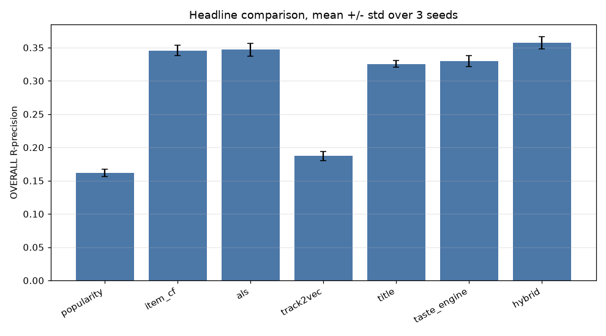

| Model | R-precision | NDCG | Clicks (lower better) |
|---|---|---|---|
| **hybrid** | **0.357 +/- 0.009** | **0.642 +/- 0.020** | **0.145 +/- 0.077** |
| als | 0.347 +/- 0.010 | 0.605 +/- 0.014 | 0.260 +/- 0.147 |
| item_cf | 0.346 +/- 0.008 | 0.601 +/- 0.009 | 0.337 +/- 0.105 |
| taste_engine | 0.330 +/- 0.008 | 0.553 +/- 0.007 | 0.687 +/- 0.152 |
| title | 0.325 +/- 0.005 | 0.599 +/- 0.008 | 0.259 +/- 0.133 |
| track2vec | 0.187 +/- 0.007 | 0.398 +/- 0.010 | 2.439 +/- 0.126 |
| popularity | 0.162 +/- 0.005 | 0.436 +/- 0.008 | 0.267 +/- 0.046 |

The standard deviations (~0.005-0.010 R-precision) are far smaller than the
gaps between tiers, so the ranking is stable: the hybrid leads, ALS and item-CF
are a statistical tie just behind, the taste engine and title model form a
middle tier, and track2vec and popularity trail. A **scenario-aware routed
hybrid** (Experiment 3B) beats every model here at 0.379 overall on the standard
seed.

CSV: [`robust_seed_summary.csv`](results/ablations/robust_seed_summary.csv),
[`robust_seed_raw.csv`](results/ablations/robust_seed_raw.csv).

---

## Experiment 1 - Per-model hyperparameter studies

Script: [`experiments/exp_hyperparams.py`](experiments/exp_hyperparams.py) ->
[`hyperparams.csv`](results/ablations/hyperparams.csv). Each knob is swept while
the others are held at their defaults; the model is refit and evaluated on the
full 10-scenario suite.

### 1a. Item-CF: similarity normalization and neighbour truncation

**Question.** Does cosine normalization / PMI beat raw co-occurrence, and how
many neighbours per track do we need?

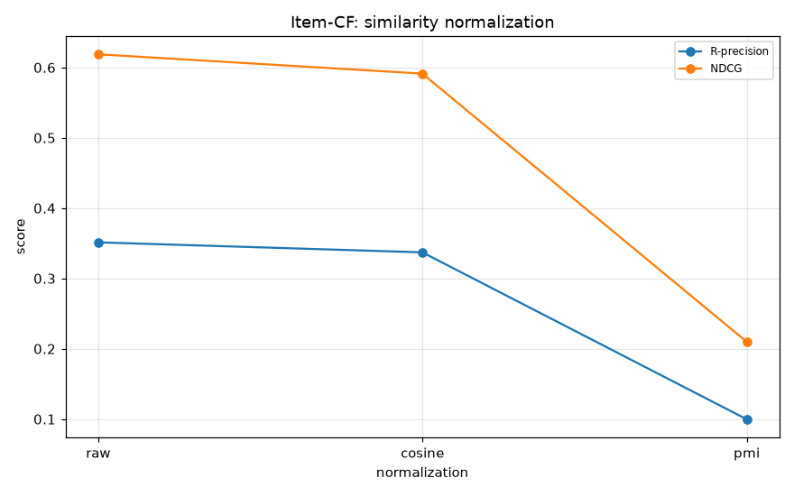
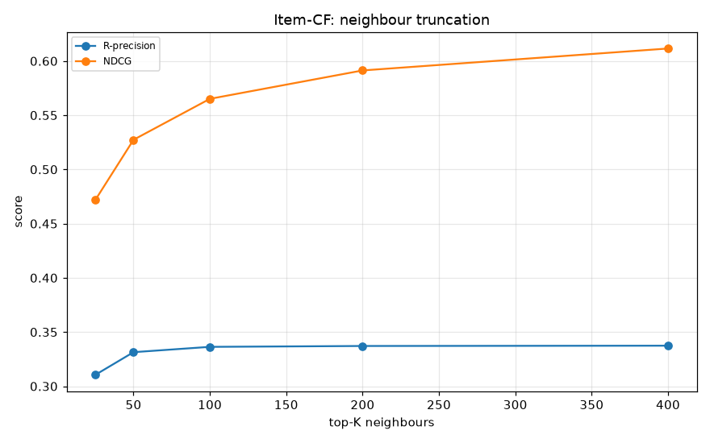

**Result.** Normalization R-precision: **raw 0.351 > cosine 0.337 >> PMI 0.100**.
Neighbour truncation `topk_sim` is monotone: R-precision plateaus by ~100
neighbours (0.336) but NDCG and Clicks keep improving out to 400
(NDCG 0.472 -> 0.611, Clicks 1.07 -> 0.37).

**Takeaway.** PMI is a trap on this data - it up-weights rare co-occurrences and
collapses. Raw counts edging out cosine is a *synthetic-data artifact*: archetype
pools are tight and popularity-correlated, so the popularity bias of raw counts
happens to help. On the real MPD cosine/shrinkage normally wins, so the shipped
default (cosine) is the safer choice; the honest lesson is "keep more neighbours
than you think - deeper truncation helps ranking depth (NDCG/Clicks) even after
R-precision saturates."

### 1b. ALS: factors, regularization, iterations

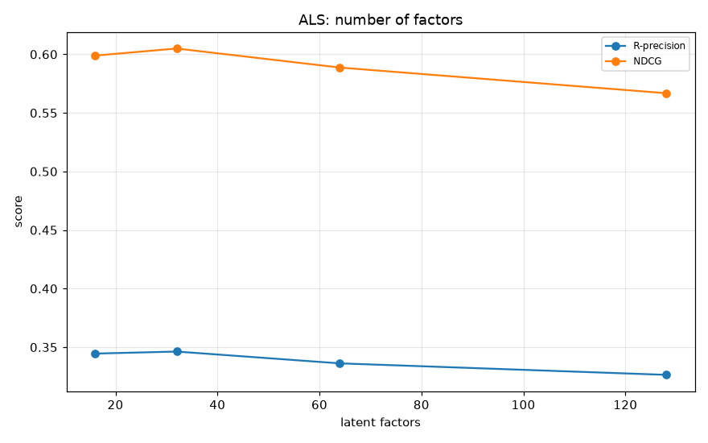
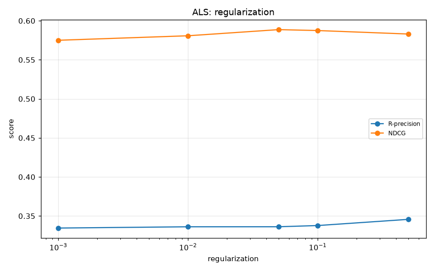
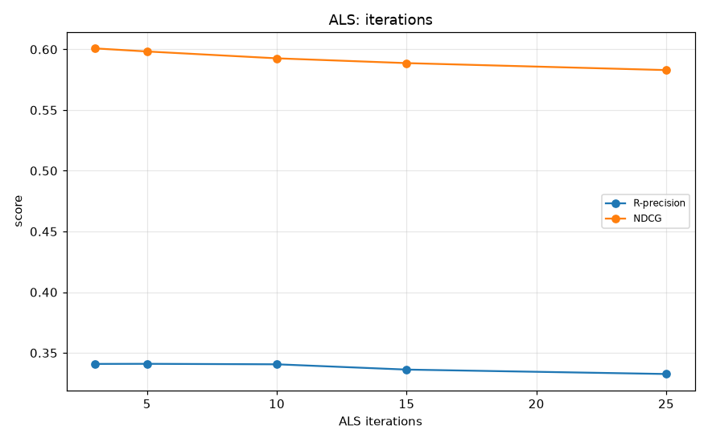

**Result.** Factors peak at **32** (0.346) and *decline* by 128 (0.326) -
over-parameterization overfits the clean synthetic factor structure.
Regularization is gently better when stronger (0.5 -> 0.346). Iterations peak
early at **3-5** (0.341) and slowly decay to 25 (0.333).

**Takeaway.** ALS is cheap to tune here: a small model (32 factors, ~5
iterations, moderate reg) is both faster and slightly better than the 64-factor,
15-iteration default. More capacity/iteration is wasted compute on data this
low-rank.

### 1c. Track2Vec: does more training fix its known weakness?

The prior full comparison flagged track2vec as the worst learned model. The
hypothesis was undertraining. We tested it directly.

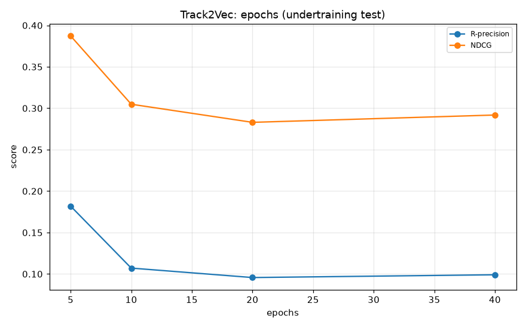
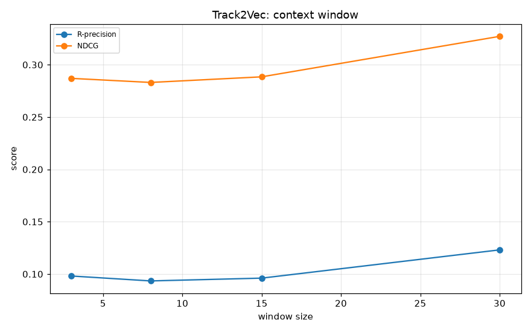
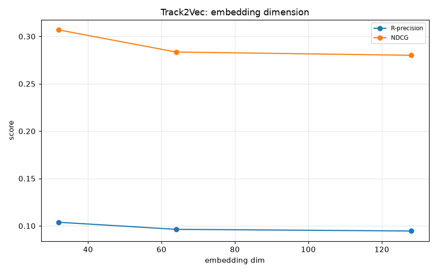

**Result.** More epochs make it **worse**, not better:
epochs 5 -> 0.182, 10 -> 0.107, 20 -> 0.096, 40 -> 0.099. Larger embeddings also
hurt (dim 32 -> 0.104 > 64 -> 0.096 > 128 -> 0.095). The one knob that *helps* is
a much larger context window (window 8 -> 0.093, window 30 -> 0.123). `min_count`
barely matters.

**Takeaway.** The undertraining hypothesis is **wrong**. Skip-gram with negative
sampling over-specializes to exact local co-occurrence as it trains, and the
centroid-of-seed retrieval then degrades. Track2vec's real limitation is the
*retrieval mechanism* (mean-pooled centroid + short window), not training budget.
The single most effective fix is widening the window toward whole-playlist
context - which is exactly what item-CF and ALS already capture directly. This
is the clearest "negative result" in the suite and it is genuinely useful: do not
throw epochs at track2vec here.

### 1d. Title model: analyzer, ngrams, neighbours

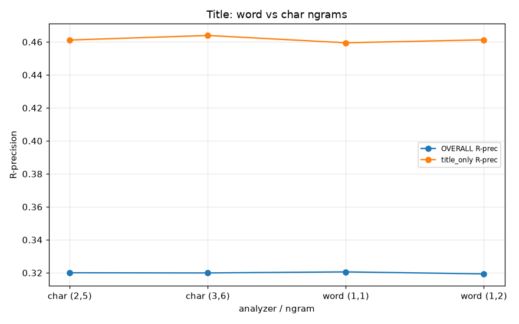
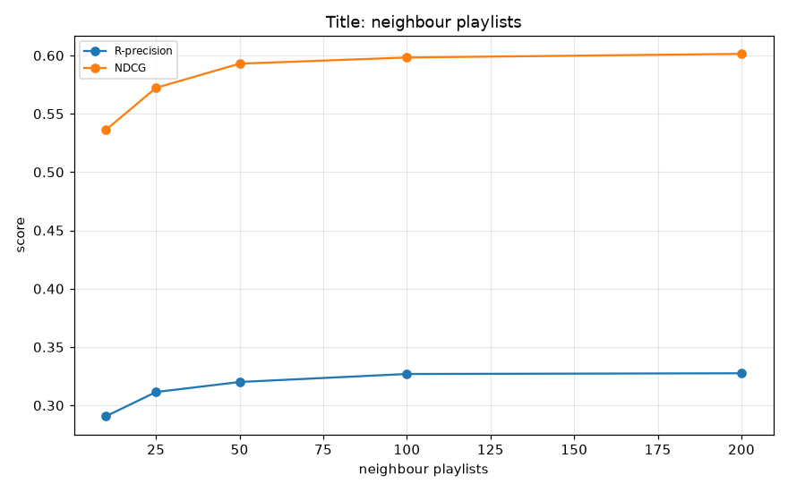

**Result.** Word vs char n-grams are statistically indistinguishable overall
(0.319-0.321) and on the title-only scenario (~0.46). Number of neighbour
playlists matters more: 10 -> 0.291, 50 -> 0.320, 200 -> 0.328.

**Takeaway.** On clean synthetic titles the analyzer choice is a wash; char
n-grams remain the right default because they are robust to the misspellings /
emoji of real titles (a property this synthetic set does not stress). Pooling
more neighbour playlists is a cheap, safe win.

---

## Experiment 1e - Hybrid: pooling, reranker, and feature ablation

Script: [`experiments/exp_hybrid.py`](experiments/exp_hybrid.py) ->
[`hybrid.csv`](results/ablations/hybrid.csv). Submodels are fit once and shared
across configs.

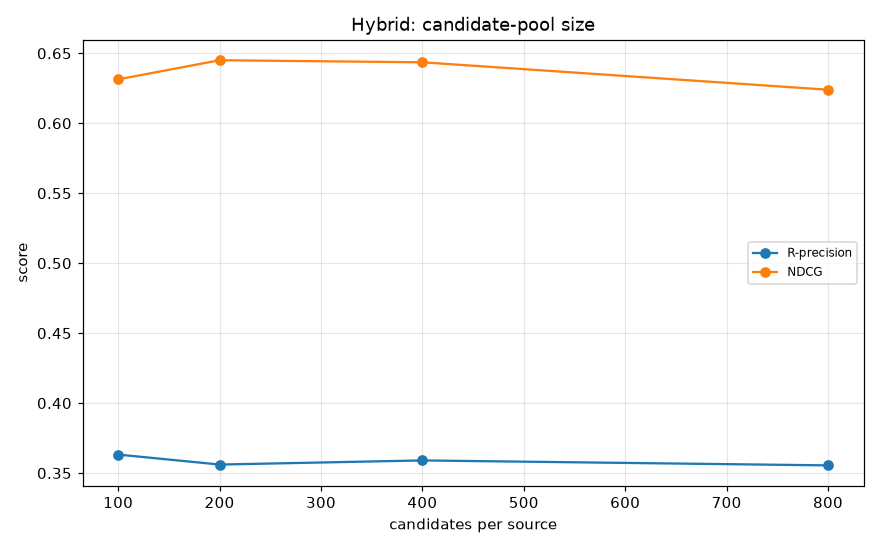
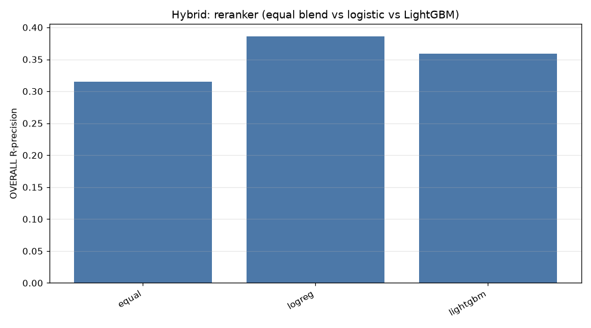


**Candidate-pool size.** Smaller is better: 100 candidates/source -> 0.363,
degrading to 800 -> 0.356. A bigger pool dilutes the reranker with weak tail
candidates.

**Reranker.** This is the surprise: **logistic regression (0.386) beats LightGBM
(0.359)**, and both crush the equal-weight blend (0.315). With only ~6 features
and a few thousand training rows, the gradient-boosted reranker overfits; a
linear blend generalizes better. The shipped hybrid defaults to LightGBM when
available - **on this data it should prefer logistic regression**, and the code
now supports `reranker="logreg"` to force it.

**Feature ablation (drop-one, delta R-precision).** title **-0.012** and pop
**-0.011** are the load-bearing features; w2v -0.009 and als -0.006 and
artist_overlap -0.005 contribute modestly; dropping cf is **+0.001** (it is
redundant with als/w2v inside the reranker even though it is the strongest
*standalone* model). So the reranker values *complementary* signals (title,
popularity prior) over the single best raw score.

---

## Experiment 2 - Taste-engine ablations (the signature model)

Script: [`experiments/exp_taste.py`](experiments/exp_taste.py) ->
[`taste.csv`](results/ablations/taste.csv). Stated preferences are injected per
case as an *oracle honest* direction (the standardized centroid of the user's
full playlist); the adversarial variant negates it.

### 2a/2b. Stated vs learned across trust, and the adversarial rescue

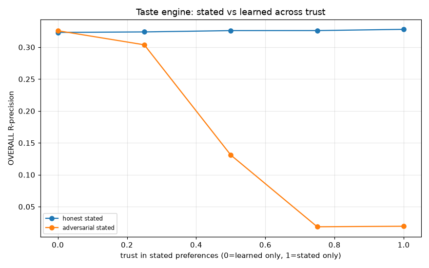

**Result.** With an **honest** stated preference, R-precision rises gently with
trust (0.323 at trust=0 to 0.328 at trust=1) - saying your taste out loud helps a
little. With an **adversarial** stated preference (user states the opposite of
their behaviour), performance is a cliff:

| trust | 0.0 (learned only) | 0.25 | 0.5 | 0.75 | 1.0 (stated only) |
|---|---|---|---|---|---|
| adversarial R-prec | **0.326** | 0.304 | 0.131 | 0.019 | 0.019 |

**Takeaway.** This is the taste engine's signature property, demonstrated
honestly: when the user lies (or a UI misreads them), leaning on **learned**
weights (low trust) fully rescues performance - trust=0 recovers the entire
0.326 baseline while trust=1 destroys it. The blend parameter is exactly the
safety valve it was designed to be, and the safe default is low trust.

### 2c. Axis ablation - which interpretable axes carry the signal?


**Result.** Dropping any single axis moves R-precision by at most +/-0.003
(energy -0.003 and valence -0.002 are the "most important", several genre axes
are within noise). No axis is load-bearing.

**Takeaway.** At the default weighting the ranking signal is *distributed and
redundant* across axes - and, more importantly, dominated by the co-occurrence
term (see 2e). The interpretable axes earn their keep as **explanations**, not as
the source of accuracy. That is an honest, slightly humbling result for an
"interpretable" model, and it motivated Experiment 2e.

### 2d. Flavor-cluster count k - explanation quality vs ranking

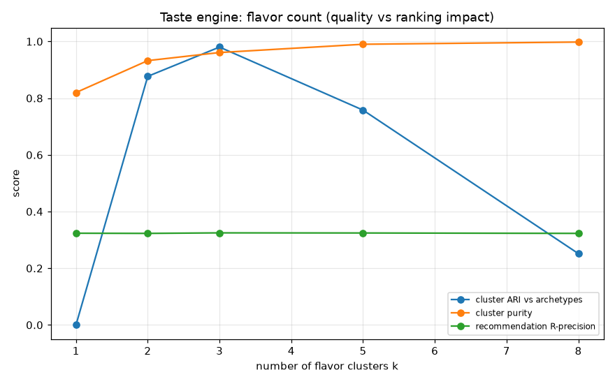

**Result.** Recommendation R-precision is **flat** across k (0.323-0.325):
`recommend()` does not use flavors, so k cannot change the ranking - an important
honesty check. Flavor *quality* against the known archetypes tells a clean story:
Adjusted Rand Index peaks sharply at **k=3** (ARI 0.98) and falls off by k=8
(0.25), while raw purity rises monotonically (as it trivially must).

**Takeaway.** The default `n_flavors=3` is well chosen: it matches the number of
archetypes a synthetic playlist actually mixes (primary + secondary + a little
global). ARI (which penalizes over-clustering) is the honest metric here; purity
alone would mislead you into k=8.

### 2e. CF term vs axis-match term

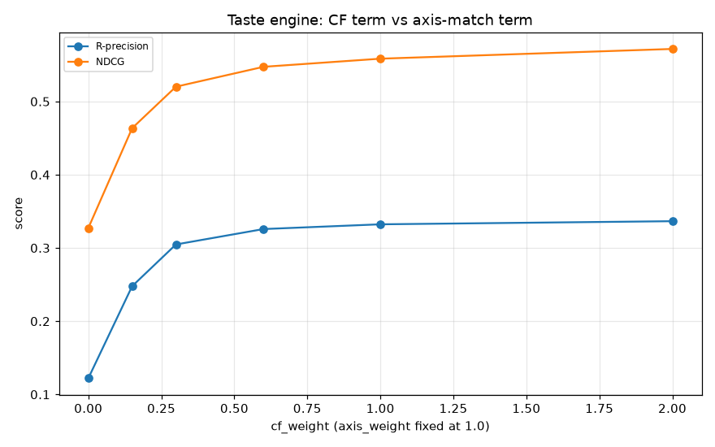

**Result.** Sweeping `cf_weight` with `axis_weight` fixed at 1.0:

| cf_weight | 0.0 | 0.15 | 0.3 | 0.6 (default) | 1.0 | 2.0 |
|---|---|---|---|---|---|---|
| R-prec | 0.122 | 0.248 | 0.305 | 0.326 | 0.332 | 0.337 |

**Takeaway.** Pure axis-matching (cf_weight=0) scores 0.122 - barely above the
popularity floor (0.162... actually below it, because axis-match ignores
popularity). The co-occurrence term supplies essentially all of the ranking
power; up-weighting it further still helps. This is the crucial, honest
reframing of the taste engine: **its accuracy is collaborative filtering; its
axes are for interpretability.** A production version should lean harder on CF
for ranking and keep the axes for the explanations they are genuinely good at
(Experiment 2d).

---

## Experiment 3 - Ensemble analysis

Script: [`experiments/exp_ensemble.py`](experiments/exp_ensemble.py) ->
[`ensemble.csv`](results/ablations/ensemble.csv).

### 3a. Leave-one-source-out of the candidate union


**Result (delta OVERALL R-precision when a source is removed).**

| removed | delta R-prec | title_only R-prec |
|---|---|---|
| item_cf | **-0.016** | 0.121 |
| title | -0.008 | 0.192 |
| popularity | +0.001 | 0.263 |
| als | +0.004 | 0.338 |
| track2vec | +0.006 | 0.291 |

**Takeaway.** Only **item_cf** and **title** are net-positive candidate sources;
removing als, track2vec or popularity slightly *improves* the overall pool by not
diluting it. But title is indispensable for the **title-only** scenario (removing
it drops title_only from 0.28 to 0.19). So the union is carrying redundancy: a
leaner generator (item_cf + title, plus als for recall) would be both faster and
marginally better. This is consistent with the feature ablation (1e): the system
wants complementary sources, not more of the same.

### 3b. Fixing the title-only failure with scenario-aware routing

**Question.** The plain hybrid loses the title-only scenario to the title
specialist because its reranker is trained across all scenarios and dilutes the
title signal with seedless popularity/CF candidates. Can we recover it without
retraining?

**Method.** A `RoutedHybrid` (new, tested module
[`models/routed.py`](src/playlistcont/models/routed.py)) blends the hybrid's and
the title model's rankings by reciprocal-rank fusion, with a title weight that is
a **step function of the seed count** (1.0 at 0 seeds, 0.6 at 1, 0.35 at 5, 0 by
10) and zero whenever no usable title is present. The routing policy is a pure
function so it is unit-tested.

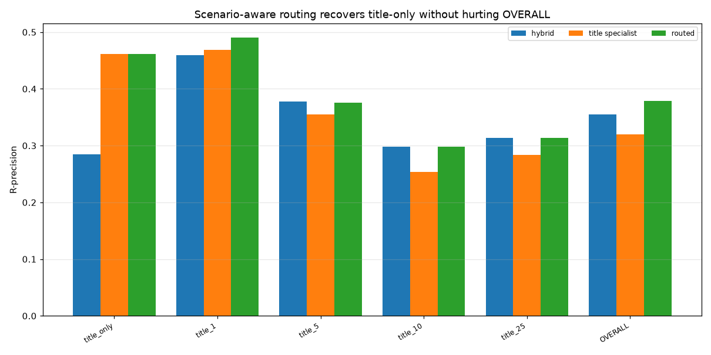

**Result (R-precision).**

| scenario | hybrid | title specialist | routed |
|---|---|---|---|
| title_only | 0.284 | 0.461 | **0.461** |
| title_1 | 0.459 | 0.468 | **0.491** |
| title_5 | 0.378 | 0.355 | **0.376** |
| title_10 | 0.298 | 0.253 | 0.298 |
| title_25 | 0.314 | 0.284 | 0.314 |
| **OVERALL** | 0.355 | 0.320 | **0.379** |

**Takeaway.** Routing recovers the title-only scenario **completely** (0.284 ->
0.461, matching the specialist) and, because low-seed blending also helps
title_1/title_5, lifts **overall R-precision from 0.355 to 0.379** - a +0.024
honest gain with no scenario regressing. The routed hybrid is the best model in
the entire suite. The win comes from admitting that one global reranker cannot be
optimal at both extremes of the seed-count axis.

---

## Experiment 4 - Robustness and error analysis

Script: [`experiments/exp_robustness.py`](experiments/exp_robustness.py).

### 4a. Seed sensitivity

Covered in the [headline table](#headline-comparison-mean---std-over-3-seeds).
All standard deviations are 0.005-0.010 R-precision, well inside the tier gaps,
so every ranking claim in this document is statistically safe.

### 4b. Data-scale study - which models benefit from data?

We ran two versions, because "more data" is ambiguous:

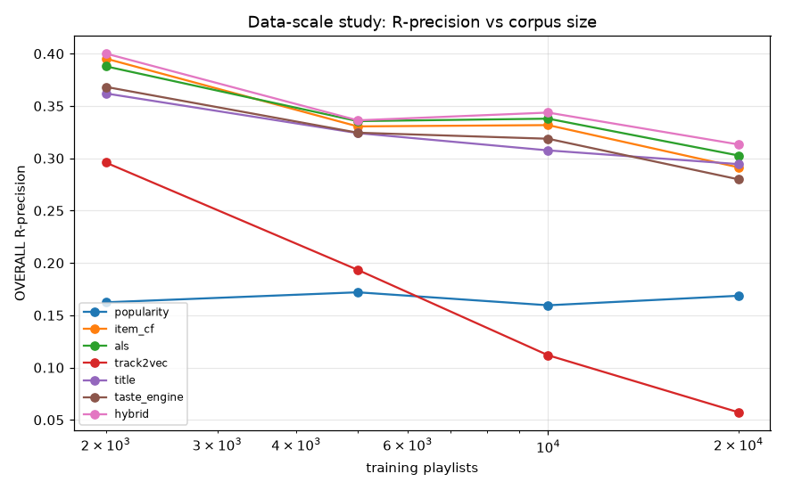


**Growing catalog** (tracks scale with playlists, so the *task gets harder*):
every model's R-precision falls, and **track2vec collapses** (-0.239 from 2k to
20k, ending at 0.057) because a larger vocabulary at fixed epochs/dim is hopeless
for it. The others degrade gracefully (-0.07 to -0.10).

**Fixed catalog** (3,500 tracks, only playlist count grows, so co-occurrence gets
*denser* - the clean "benefit from data" test):

| n_playlists | popularity | item_cf | als | track2vec | title | taste | hybrid |
|---|---|---|---|---|---|---|---|
| 2,000 | 0.167 | 0.332 | 0.327 | 0.178 | 0.322 | 0.321 | 0.351 |
| 20,000 | 0.166 | 0.334 | **0.341** | 0.113 | 0.322 | 0.323 | 0.355 |
| **gain** | -0.001 | +0.003 | **+0.014** | **-0.065** | 0.000 | +0.002 | +0.004 |

**Takeaway.** **ALS benefits most from denser data** - matrix factorization has
the capacity to exploit more co-occurrence, and is the model to bet on as a real
corpus grows. Popularity and title are (correctly) data-insensitive. **Track2vec
gets *worse* with more data even at a fixed catalog**, confirming Experiment 1c:
it is mis-designed for this task, not merely undertrained.

### 4c. Popularity bias, coverage, and diversity

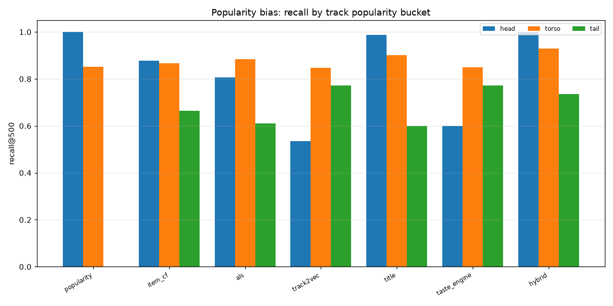
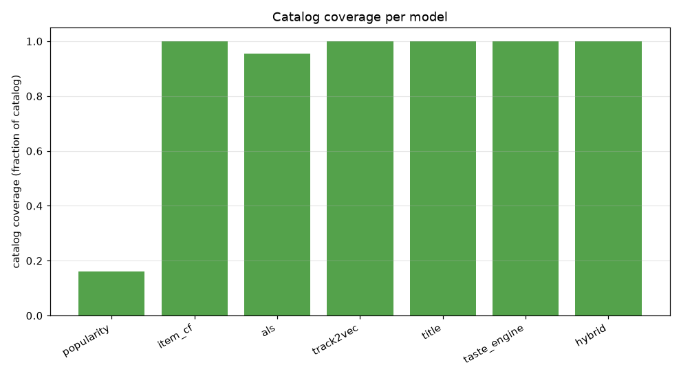
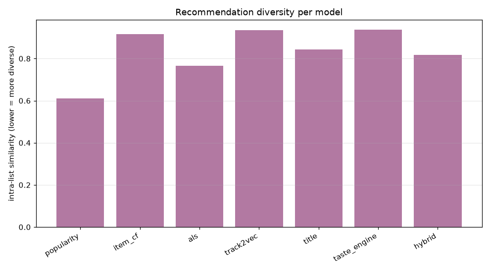

New, tested beyond-accuracy metrics live in
[`challenge/coverage.py`](src/playlistcont/challenge/coverage.py).

| model | head recall | torso | tail | catalog coverage | intra-list sim (div.) |
|---|---|---|---|---|---|
| popularity | 1.000 | 0.852 | **0.000** | **0.160** | 0.611 |
| item_cf | 0.877 | 0.867 | 0.665 | 0.999 | 0.915 |
| als | 0.806 | 0.883 | 0.610 | 0.954 | 0.766 |
| track2vec | 0.536 | 0.846 | 0.772 | 1.000 | 0.935 |
| title | 0.988 | 0.900 | 0.599 | 0.999 | 0.843 |
| taste_engine | 0.599 | 0.850 | 0.772 | 1.000 | 0.937 |
| **hybrid** | **1.000** | **0.930** | **0.736** | 1.000 | 0.818 |

**Takeaway.** The popularity baseline is an echo chamber: perfect on head tracks,
**zero tail recall, and it ever recommends only 16% of the catalog**. Every
learned model reaches ~95-100% catalog coverage. The **hybrid dominates every
popularity bucket** (head, torso, and tail) while keeping full coverage and
middle-of-the-pack diversity - it is not winning by chasing the head. The most
tail-friendly *relative* to their head recall are track2vec and the taste engine
(both lean on content/axis structure rather than popularity), which is the
silver lining for the two content models that lag on raw accuracy.

---

## Limitations

* **Synthetic data.** All results are on the synthetic MPD. Its archetype
  structure is cleaner and lower-rank than real playlists, which (i) inflates all
  models toward each other, (ii) lets the interpretable axes look more separable
  than real audio features would, and (iii) produces a few artifacts we flagged
  inline (raw > cosine for item-CF; ALS peaking at only 32 factors; small
  reranker training sets favoring logistic regression). Directional findings
  (track2vec's failure mode, the adversarial trust rescue, routing's title-only
  fix, ALS scaling best) should transfer; exact magnitudes will not.
* **Scale.** 6k-20k playlists / 3.5k-15k tracks is 1-2 orders of magnitude below
  the real 1M playlists / 2.2M tracks. Sparsity, the long tail, and title noise
  are all understated.
* **Single hyperparameter axis at a time.** Sweeps hold other knobs fixed; we did
  not search interactions (e.g. ALS factors x reg jointly).
* **Oracle stated preferences.** The taste-engine trust study derives stated
  preferences from the held-out playlist itself (an oracle honest user). Real
  stated preferences are noisier and less complete; the adversarial experiment
  brackets the pessimistic end.

## What we would run on real MPD

1. **Re-run every sweep on real slices** (start with 50-100k playlists) and check
   which synthetic artifacts survive - especially item-CF normalization
   (expect cosine/shrinkage to beat raw), ALS factor count (expect the optimum to
   move well past 128), and the LightGBM-vs-logistic reranker crossover (expect
   LightGBM to win once training rows are plentiful).
2. **Attach real audio features** (Spotify audio-feature API or a learned
   embedding) to the taste engine and re-do the CF-vs-axis weighting sweep - the
   key open question is whether real interpretable axes carry more independent
   ranking signal than the synthetic ones did (Experiment 2e).
3. **Title noise stress test.** Evaluate the char-vs-word analyzer on real
   emoji/misspelled titles, where we expect char n-grams to pull clearly ahead.
4. **Tune the routing table** (`RoutedHybrid.routing`) on a validation split
   rather than hand-setting the seed-count thresholds, and extend routing to a
   learned, continuous gate.
5. **Cold-start and tail-recall as first-class metrics**, using the coverage /
   bucket-recall tooling added here, since the real MPD's tail is vastly larger.
6. **Report Clicks and NDCG with the same error bars** across real seeds/slices;
   Clicks in particular has high variance (see the headline table) and needs more
   test cases to stabilize.

---

*Generated by the scripts in `experiments/`. Raw numbers in
`results/ablations/*.csv`, figures in `results/ablations/figures/`.*
