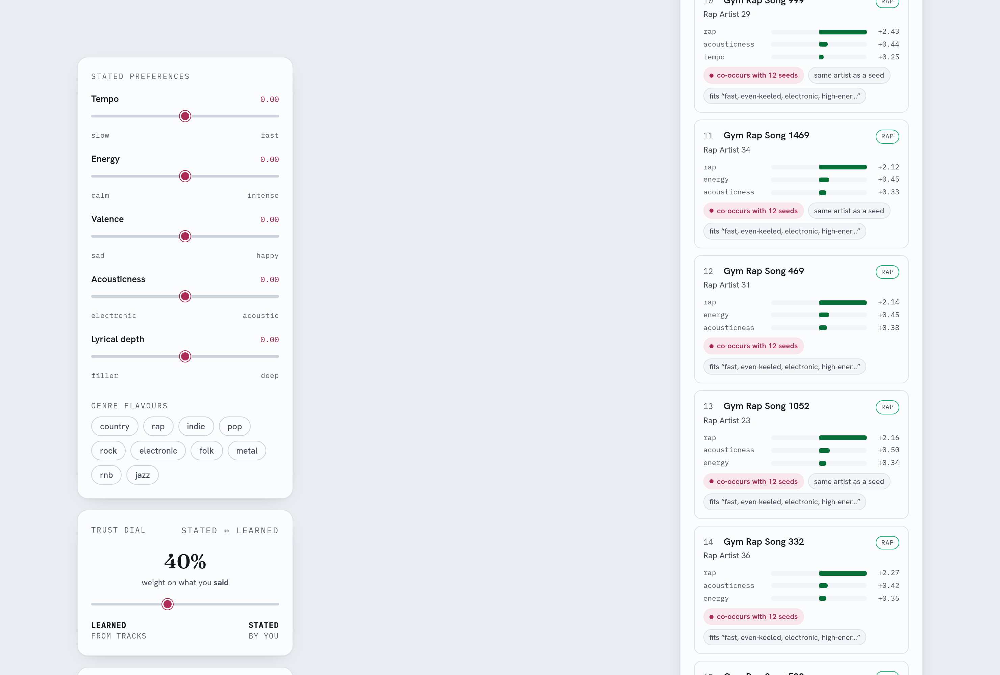
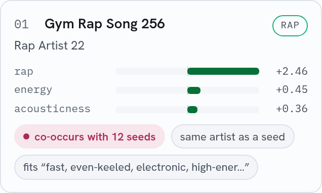
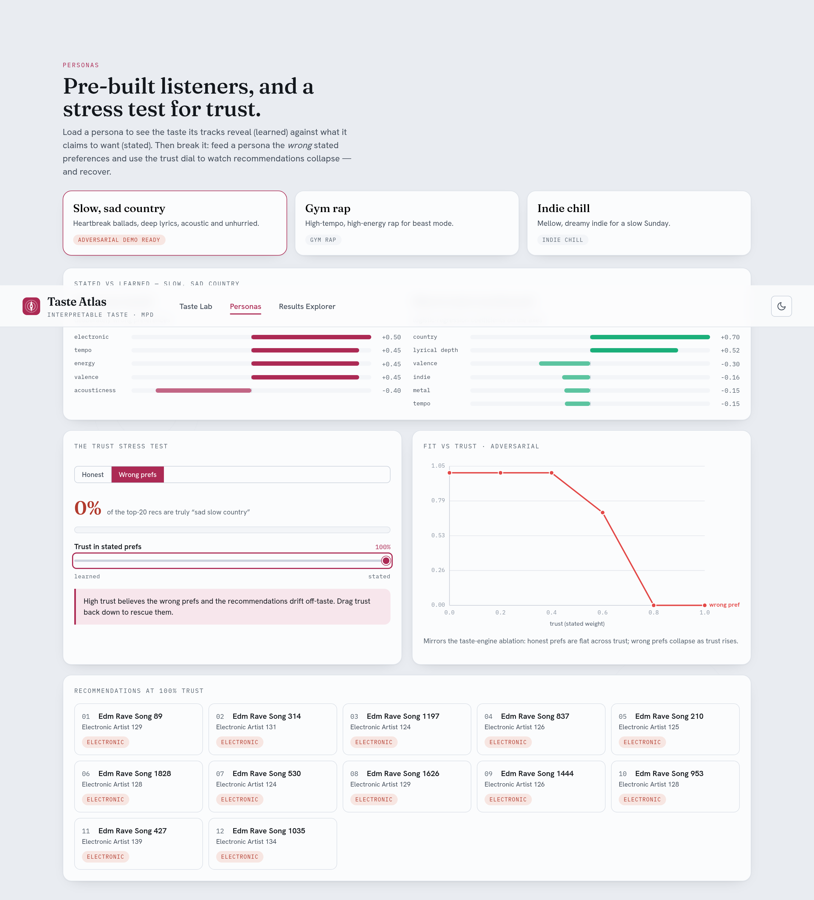

# Playlist Continuation — Spotify Million Playlist Dataset (RecSys 2018)

A from-scratch playlist-continuation project built around the **Spotify Million
Playlist Dataset Challenge** (ACM RecSys Challenge 2018). It implements a full,
tested challenge harness and a catalogue of seven recommenders — from a
popularity baseline up to a two-stage learned ensemble — and compares them
across all ten official test scenarios. The signature piece is an
**interpretable Taste Engine** that recommends by explicit, human-readable taste
axes and explains every recommendation.

Because the real MPD is gated behind AIcrowd registration, everything runs
end-to-end on a built-in **synthetic MPD generator** that reproduces the
statistical structure of real playlists; a single flag switches to the real
data once you've downloaded it.

```
python experiments/run_comparison.py     # trains all 7 models, evaluates 10 scenarios, ~40s
pytest                                    # 49 tests
playlistcont dashboard                    # Taste Atlas — the interactive app (see below)
```

---

## Key findings

All numbers are on **synthetic MPD** (see the scope note below) and are grounded in the
CSVs under `results/`. Full write-up in **[`REPORT.md`](REPORT.md)**.

1. **The two-stage hybrid wins overall** — R-precision **0.357 ± 0.009** over three data
   seeds, ahead of ALS (0.347) and item-CF (0.346), reproducing the "candidate
   generation + learned rerank" recipe that dominated the real 2018 challenge.
2. **A scenario-aware routed hybrid tops the entire suite at 0.379** (vs 0.355 for the
   plain hybrid): routing cold-start queries to the title specialist recovers
   `title_only` completely (**0.284 → 0.461**) with **no scenario regressing** (+0.024
   overall).
3. **The title model is indispensable for the cold start** — **0.474** R-precision on
   `title_only` where every other standalone model is pinned at the popularity floor
   (0.193), because they have no seed tracks to work with.
4. **The Taste Engine's accuracy is collaborative filtering, not its axes** — pure
   axis-matching scores only **0.122** R-precision (below the 0.162 popularity floor),
   and dropping any single interpretable axis moves R-precision by at most **±0.003**.
   The axes earn their keep as *explanations* and as flavor clusters (Adjusted Rand Index
   peaks at **0.98** for k=3), not as ranking signal.
5. **Track2Vec is mis-designed, not undertrained** — more epochs make it monotonically
   *worse* (**0.182 → 0.099** from 5 to 40 epochs); only a wider context window helps.
   Its flaw is the mean-pooled-centroid retrieval, not the training budget.
6. **ALS benefits most from denser data** (**+0.014** R-precision from 2k → 20k playlists
   at a fixed catalogue), and the **hybrid dominates every popularity bucket** (head,
   torso, tail) at ~100% catalog coverage while popularity touches only **16%**.

**Explore it:** research write-up in **[`REPORT.md`](REPORT.md)** · interactive tours in
**[`notebooks/`](notebooks/)** (`01_demo.ipynb` — the Taste Engine end-to-end;
`02_experiments.ipynb` — the full synthetic analysis; `03_real_mpd.ipynb` — the
real-data results) · real-data write-up in **[`REAL_RESULTS.md`](REAL_RESULTS.md)** ·
all figures in **[`visualizations/`](visualizations/)**.

> **Scope.** The findings above are on a seeded *synthetic* MPD generator. They are for
> *relative* model comparison and design validation. **A full real-MPD run has since been
> done** (below) — read it for which of these conclusions actually transferred.

## Real-data results (the real 1M-playlist MPD)

The whole harness was re-run on the **real** Spotify Million Playlist Dataset, streamed
directly from the official 5.4 GB zip (**1,000,000 playlists, 66.3M interactions, 2.26M
unique tracks**) — never extracted. Popularity was computed at full 1M scale; the other
models were trained on a **150k-playlist subsample** (120,851 tracks; full-1M item-CF
co-occurrence does not fit 15 GB RAM). 6,000 real playlists were held out into the ten
scenarios. Full write-up: **[`REAL_RESULTS.md`](REAL_RESULTS.md)**; figures in
`results/real/`.

| model | R-precision | NDCG | Clicks (↓) |
|-------|-------------|------|------------|
| **item_cf** | **0.148** | **0.292** | 5.69 |
| hybrid | 0.131 | 0.277 | **5.10** |
| routed_hybrid | 0.129 | 0.271 | 5.44 |
| als | 0.113 | 0.226 | 8.07 |
| title | 0.063 | 0.130 | 16.88 |
| track2vec | 0.058 | 0.125 | 14.19 |
| popularity | 0.027 | 0.072 | 21.70 |

**What held, what didn't** (synthetic → real):

- **Did NOT hold — the hybrid does *not* win on real data.** Plain **item-CF wins overall
  (0.148)**; the learned reranker dilutes an already-dominant real co-occurrence signal.
  The synthetic "candidate-generation + rerank supremacy" was an artifact of a generator
  too kind to the reranker.
- **Did NOT hold — routing is net-neutral overall** (routed 0.129 vs hybrid 0.131), because
  the real title model is weak; but…
- **HELD — the title model still owns the `title_only` cold start** (0.076 vs 0.044 for the
  plain hybrid) and **routing still rescues that bucket** (0.044 → 0.076).
- **HELD — item-CF is unbeatable on large random seeds** (0.246 on `title_random_100`).
- **HELD (as predicted) — popularity's flattering synthetic *clicks* collapsed** (0.21 → 21.7);
  popularity is now the weakest model, not Track2Vec.

**Official submission.** A valid `submission.csv.gz` for the real 10k AIcrowd challenge set
is generated by `experiments/build_submission_fast.py` (a fast query-shape router: item-CF
for seeded playlists, the title model for the cold-start bucket — mirroring the RoutedHybrid
policy) and validated with the challenge's own `verify_submission.py`. Context: the 2018
winner scored R-precision ≈ 0.2241 on the *official* test; our internal 0.148 is on a
held-out split of the *public* MPD (smaller training set, different holdouts) and is not
directly comparable.

---

## Interactive App — Taste Atlas

A local web app that makes the Taste Engine's "distill people's flavors" vision tangible —
and doubles as the project's results dashboard. Fully self-contained: on startup it
generates a seeded synthetic MPD and fits the Taste Engine + item-CF + popularity in
memory (a few seconds, zero downloads).

```
pip install -e ".[app]"        # fastapi + uvicorn
playlistcont dashboard         # builds models, serves http://127.0.0.1:8000
```

(Dev mode: `python -m uvicorn app.backend.server:app` for the API on :8000 and
`npm install && npm run dev` in `app/frontend/` for hot reload; a built bundle is
committed in `app/frontend/dist/` so the CLI works with no npm step.)

Three views:

- **Taste Lab** — stated-preference sliders on the interpretable axes plus genre chips, a
  trust dial (stated ↔ learned), a live *taste map* whose contour "territories" are the
  named flavor clusters, and a recommendation list where every item shows its WHY: signed
  axis-match bars, co-occurrence evidence chips, and the flavor it fits. Moving any slider
  re-ranks live.



  Every recommendation is explained — axis contributions, CF evidence, flavor match:



- **Personas** — one click loads "slow sad country / gym rap / indie chill", compares its
  stated axes against the weights learned from its tracks, and runs the adversarial demo:
  feed a persona deliberately *wrong* stated preferences and drag the trust dial to watch
  recommendations collapse (100% trust in wrong prefs → 0% on-taste) and recover.



- **Results Explorer** — the committed CSVs under `results/` + `results/real/` rendered as
  charts: the synthetic-vs-real headline comparison (item-CF's 0.148 win on real data),
  the per-scenario heatmap, the taste-engine trust ablation curves, and the
  held / didn't-hold verdict table.

Backend tests live in `app/tests/` (pytest); e2e + axe-core accessibility tests in
`app/frontend/e2e/` (Playwright). More screenshots in [`app/screenshots/`](app/screenshots/)
and [`visualizations/`](visualizations/).

---

## The challenge

Given an incomplete playlist (its title and/or some of its tracks), recommend up
to **500** tracks that fit. The test set has **10 scenarios × 1,000 playlists**:

| # | Scenario | Seed given |
|---|----------|------------|
| 1 | title only | title, 0 tracks |
| 2 | title + first 1 | title + 1 track |
| 3 | title + first 5 | title + 5 tracks |
| 4 | first 5, no title | 5 tracks |
| 5 | title + first 10 | title + 10 tracks |
| 6 | first 10, no title | 10 tracks |
| 7 | title + first 25 | title + 25 tracks |
| 8 | title + random 25 | title + 25 random tracks |
| 9 | title + first 100 | title + 100 tracks |
| 10 | title + random 100 | title + 100 random tracks |

**Metrics** (all implemented in `challenge/metrics.py`, unit-tested against
hand-computed values):

- **R-precision** — track matches in the top-R predictions plus **0.25 credit**
  for matching an artist the ground truth contains (R = number of held-out
  tracks). Higher is better.
- **NDCG** — normalized discounted cumulative gain over the full list. Higher is
  better.
- **Recommended Songs Clicks** — `floor(rank_of_first_hit / 10)`; the number of
  "refresh" clicks (10 songs each) before the first correct track. Penalty 51 if
  no hit in 500. Lower is better.

**Submission format** (`challenge/submission.py` writes and validates it):

```
team_info,my cool team name,contact@email.com

pid, track_uri_1, track_uri_2, ... (≤500, no dupes, no seed tracks)
...
```

---

## Data strategy: synthetic ↔ real MPD

The real MPD ships as 1,000 JSON slice files of 1,000 playlists each. We support
both real and synthetic data behind one `Dataset` type, so a single flag swaps
them everywhere.

**Real MPD** (`data/loader.py`): a schema-faithful loader for the official
`mpd.slice.*.json` files. Download the dataset from AIcrowd, then:

```python
from playlistcont.data.loader import load_mpd
ds = load_mpd("/path/to/spotify_mpd/data", max_slices=20)
```

**Synthetic MPD** (`data/synthetic.py`): a generator that mimics real MPD
statistics so experiments are meaningful without the download:

- **power-law track popularity** (a few hits, a long tail);
- **genre-clustered co-occurrence** — tracks from the same latent *taste
  archetype* co-occur far above chance, giving CF/MF/w2v real signal;
- **titles correlated with content** — a "gym rap" playlist gets a title drawn
  from a rap/workout vocabulary, giving the title model real signal;
- **ten latent taste archetypes** (e.g. *sad slow country*, *gym rap*, *indie
  chill*, *edm rave*, *coffeehouse folk*), each with a profile over the
  interpretable feature axes — exactly what the Taste Engine is meant to recover.

```python
from playlistcont.data.synthetic import make_synthetic
ds = make_synthetic(n_playlists=20000, n_tracks=15000, seed=0)  # default scale
```

Only the synthetic generator produces the interpretable per-track feature axes
(tempo, energy, valence, acousticness, lyrical-depth, genre vector). The real
MPD carries no audio features, so for real data you attach them via
`loader.attach_features(ds, "audio_features.csv")` — a CSV of per-track audio
features / genres exported from the Spotify audio-features API or an offline
genre model. See the [Taste Engine on real data](#taste-engine-on-real-data)
note below.

---

## Model catalogue

All models share one interface — `fit(dataset)` and
`recommend(seed_tracks, title, k=500)` — so they are directly swappable and
comparable (`models/base.py`).

| Model | File | Intuition |
|-------|------|-----------|
| **Popularity** | `popularity.py` | Always recommend the globally most-played tracks. The floor every other model must beat. |
| **Item-item CF** | `itemcf.py` | Tracks that co-occur in many playlists are similar. Builds a sparse track–track similarity (cosine or PMI) and sums the seed tracks' neighbour columns. Fast, strong, and *unbeatable on large random seeds*. |
| **ALS (matrix factorization)** | `mf.py` | Learn low-rank playlist/track factors from implicit feedback; new playlists are folded in as the mean of their seed item-vectors. Uses the `implicit` library, with a self-contained numpy ALS fallback. The most consistent single model. |
| **Track2Vec** | `track2vec.py` | word2vec over "playlists as sentences, tracks as words". Recommend the nearest tracks to the seed centroid. Captures sequential/embedding structure but needs a lot of data to shine. |
| **Title model** | `title_model.py` | Char n-gram TF-IDF over playlist *titles* → nearest playlists → pool their tracks. The **only** model with signal in the title-only scenario. |
| **Hybrid ensemble** | `hybrid.py` | Two-stage: union candidates from all models above, then rerank with a **LightGBM** classifier (logistic-regression fallback) on per-candidate features — CF score, ALS score, w2v similarity, title score, popularity, artist overlap. Trained on held-out tracks from the training playlists. Mirrors the winning 2018 recipe and wins overall. |
| **Taste Engine** ⭐ | `taste_engine.py` | Interpretable, explainable recommender — see below. |

---

## ⭐ The Taste Engine (signature model)

Every other model is a black box: it returns tracks but can't tell you *why*.
The Taste Engine reasons in **interpretable axes** and explains itself.

**1. Interpretable track features.** Each track is a point in axis space:
`tempo` (slow↔fast), `energy` (calm↔intense), `valence` (sad↔happy),
`acousticness` (electric↔acoustic), `lyrical_depth` (filler↔meaningful), plus a
soft **genre vector**. (Synthetic data generates these; real data supplies them
via an audio-features CSV.)

**2. Two sources of preference.**

- **STATED** — the user says what they care about, in words or a dict:
  `"melody and meaning matter most, I love slow sad country"`. A lexicon
  (`parse_stated`) turns that into signed axis emphases (lyrical_depth ↑, valence
  ↓, tempo ↓, country ↑).
- **LEARNED** — a logistic regression of *"is this track in your playlists?"*
  onto the standardized axes, blended with the user's centroid direction for
  stability. The coefficients **are** the preference vector: negative valence =
  you lean sad, positive lyrical_depth = you value meaning.

They are combined with a **`trust`** parameter (how much to believe what the user
*said* over what they *did*).

**3. Named flavor clusters.** k-means on the user's tracks in raw axis space,
each centroid turned into English by a template — e.g.
`"slow, sad, acoustic country with deep lyrics"`.

**4. Scoring + explanations.** Candidates are scored as *weighted axis-match +
co-occurrence*, and every recommendation carries a human explanation.

### Example (real output from `make_synthetic`, a "sad slow country" listener)

```
FLAVOR CLUSTERS:
  - slow, sad, acoustic country with deep lyrics  (share 38%)
  - slow, sad country with deep lyrics            (share 25%)

LEARNED preference weights (top axes):
  genre:country      +0.60
  lyrical_depth      +0.52
  valence            -0.42     ← leans sad
  tempo              -0.29     ← leans slow

TOP RECOMMENDATIONS WITH EXPLANATIONS (stated+learned blend):
  spotify:track:s000093
     recommended because: matches your 'slow, sad, acoustic country with deep
     lyrics' flavor (valence 0.11, tempo 0.19); co-occurs with 8 of your seed
     tracks; same artist as one of your seeds
  spotify:track:s001513
     recommended because: matches your 'slow, sad country with deep lyrics'
     flavor (valence 0.13, tempo 0.32); co-occurs with 8 of your seed tracks
```

The Taste Engine is a **real, trained model in the comparison**, not a mock. It
optimizes for *explainable taste match* rather than raw recall, so it sits in the
CF pack on R-precision (0.30) while being the only model that can justify itself
and accept explicit user control. Its unit tests verify that a user built from
sad/slow tracks actually gets negative valence/tempo and positive
lyrical-depth/country learned weights.

### Taste Engine on real data

The MPD has no audio features. For the **real-data run** we joined a public
Spotify audio-features table (`ozefe/spotify_audio_features` on the HF Hub) onto
the MPD track_uris on the shared 22-char id (`data/real_features.py`), with this
axis mapping:

| Axis | Real-MPD source |
|------|-----------------|
| tempo, energy, valence, acousticness | audio-features table (`tempo`→min-max normalized; `energy`/`valence`/`acousticness` direct) |
| lyrical_depth | proxy = `1 - instrumentalness` (documented rough stand-in; no lyric-content signal available) |
| genre vector | unavailable in the audio table → left at 0 |

Match rate against popular MPD tracks was ~44% (4 of 10 shards), so the taste
engine was evaluated on the **feature-covered subset** — see
[`REAL_RESULTS.md`](REAL_RESULTS.md). You can also supply your own CSV and call
`loader.attach_features(ds, csv)`; without features the engine is skipped and
the other models still run.

---

## Results summary

Full analysis in [`RESULTS.md`](RESULTS.md); tables in
[`results/`](results/); charts in [`results/figures/`](results/figures/). Overall
(micro-averaged over all scenario cases, synthetic MPD):

| model | R-precision | NDCG | Clicks (↓) |
|-------|-------------|------|------------|
| **hybrid** | **0.322** | **0.608** | **0.126** |
| als | 0.311 | 0.568 | 0.433 |
| item_cf | 0.309 | 0.562 | 0.451 |
| title | 0.308 | 0.577 | 0.222 |
| taste_engine | 0.300 | 0.514 | 1.348 |
| popularity | 0.168 | 0.435 | 0.206 |
| track2vec | 0.120 | 0.313 | 6.246 |

Headline findings: the **hybrid ensemble wins overall**; the **title model is
indispensable for the title-only cold start** (0.474 vs a 0.193 floor); simple
**item-CF is unbeatable on large random seeds**; and the **Taste Engine trades a
little recall for full interpretability**. (These are synthetic-data numbers —
good for relative comparison, not comparable to the real leaderboard.)

### Deep-dive experiments and ablations

For the full research study — per-model hyperparameter sweeps, the taste-engine
ablations (stated-vs-learned trust curves, an adversarial "wrong preferences"
rescue, axis and flavor-count ablations), ensemble leave-one-out, a
scenario-aware **routed hybrid** that fixes the title-only failure (+0.024
overall), and robustness (3-seed error bars, data-scale, popularity-bias /
coverage / diversity) — see **[`ABLATIONS.md`](ABLATIONS.md)**. All of it is
reproducible via `python experiments/run_all.py` (~30 min); scripts in
[`experiments/`](experiments/), outputs in
[`results/ablations/`](results/ablations/).

Selected results: a **routed hybrid** tops the suite at **0.379** overall
R-precision (vs 0.357 for the plain hybrid); **track2vec gets worse with more
epochs** (undertraining was the wrong diagnosis); the taste engine's accuracy is
**collaborative filtering, not its axes** (pure axis-match scores only 0.122);
and **ALS benefits most from denser data**.

---

## Running on the real MPD

The real dataset ships as one big zip. `data/mpd_zip.py` **streams slices
directly from the zip** (never extracting the ~33 GB), so the whole pipeline runs
in bounded memory:

```bash
# full model comparison + internal held-out eval + (optional) submission
python experiments/run_real.py \
    --zip .data/spotify_million_playlist_dataset.zip \
    --n-corpus 150000 --min-count 8 --n-test 6000 --per-scenario 250

# fast, validated AIcrowd submission on the real 10k challenge set
python experiments/build_submission_fast.py \
    --n-corpus 200000 --min-count 8 --out .data/submission.csv

# Taste Engine on real audio features (matched subset)
python experiments/run_taste_real.py --features .data/af/data --n-corpus 150000
```

Downloads live in a **gitignored `.data/`** (never committed). The legacy
directory-of-slices path (`load_mpd(dir)`, `run_comparison.py --real DIR`) still
works if you extract the slices yourself.

---

## Project layout

```
playlist-continuation/
├── pyproject.toml
├── README.md · REPORT.md · RESULTS.md · ABLATIONS.md · REAL_RESULTS.md
├── src/playlistcont/
│   ├── data/        schema.py · loader.py · mpd_zip.py (zip streaming) · real_features.py · synthetic.py
│   ├── challenge/   metrics.py · scenarios.py · submission.py · coverage.py
│   └── models/      base.py · popularity · itemcf · mf · track2vec · title_model · hybrid · routed · taste_engine
├── experiments/     run_comparison.py · run_all.py · exp_*.py · run_real.py · build_submission_fast.py · run_taste_real.py · analyze_real.py
├── notebooks/       01_demo.ipynb · 02_experiments.ipynb · 03_real_mpd.ipynb (executed)
├── visualizations/  all figures consolidated (synthetic + real + ablations)
├── results/         results.csv · figures/ · ablations/ · real/ (real-data CSVs + figures)
└── tests/           metrics · loader · mpd_zip · submission · recommenders · taste_engine · ablations (49 tests)
```

## Install

```bash
pip install -e .            # core
pip install -e ".[fast]"    # + implicit (ALS) and lightgbm (reranker); both have fallbacks
pip install -e ".[dev]"     # + pytest
```

---

## References

- Chen et al., *"Recsys Challenge 2018: Automatic Music Playlist Continuation"*, RecSys 2018. https://dl.acm.org/doi/10.1145/3240323.3240342
- Zamani, Schedl, Lamere, Chen, *"An Analysis of Approaches Taken in the ACM RecSys Challenge 2018 for Automatic Music Playlist Continuation"*, 2019. https://arxiv.org/abs/1810.01520
- AIcrowd challenge page. https://www.aicrowd.com/challenges/spotify-million-playlist-dataset-challenge
- Volkovs et al. (1st place, "Two-stage Model for Automatic Playlist Continuation") and hojinYang (2nd place) — candidate generation + gradient-boosted rerank ensembles that inspired the hybrid model.
- Hu, Koren & Volinsky, *"Collaborative Filtering for Implicit Feedback Datasets"*, 2008 (the ALS used in `mf.py`).
```
