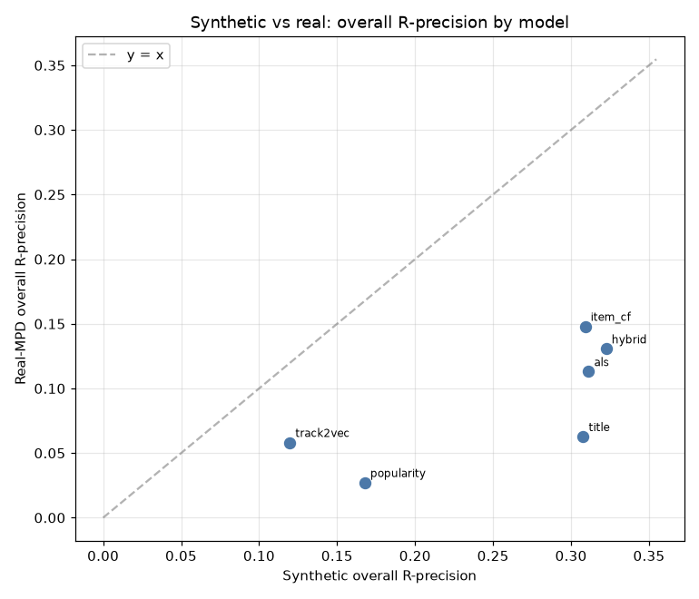
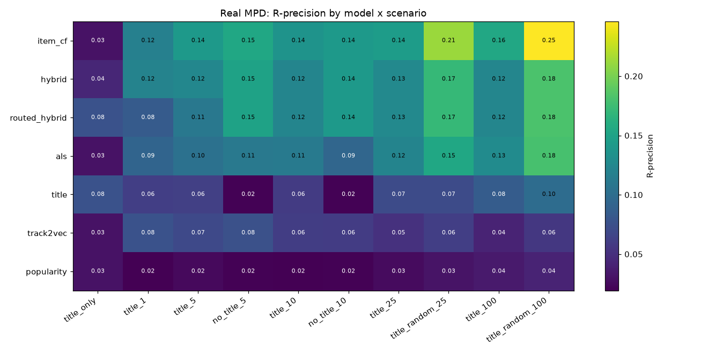
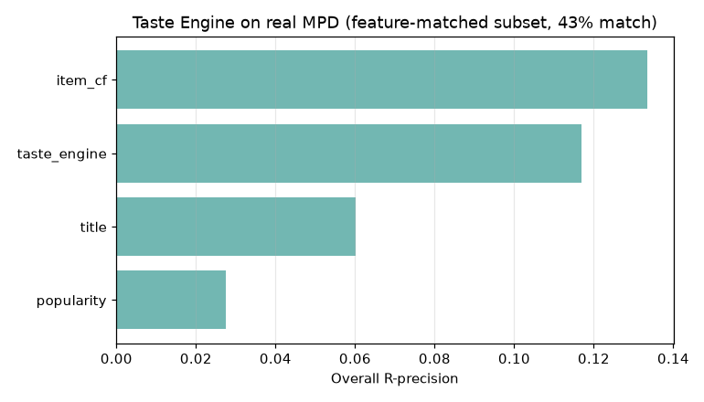

# Real-Data Results — Spotify Million Playlist Dataset

This document reports the **real-MPD** run of the project: the same models,
challenge harness, and metrics that were validated on synthetic data
(`RESULTS.md`, `ABLATIONS.md`) applied to the actual 1M-playlist dataset,
plus an official AIcrowd submission generated on the real 10k challenge set.

> **TL;DR.** Trained on a 150k-playlist real subsample, the tier ordering from
> synthetic data only **partly held**: plain **item-CF wins on real data**
> (the learned reranker dilutes an already-dominant co-occurrence signal), the
> **title model still owns the title-only cold start**, routing still **rescues
> that bucket** but is net-neutral overall, and popularity's flattering
> synthetic clicks **collapse** as predicted. A valid `submission.csv.gz` for
> the real challenge set was produced and validated with the official verifier.

## Corpus and data pipeline

The real Spotify Million Playlist Dataset was streamed directly from the
official `spotify_million_playlist_dataset.zip` (5.4 GB, 1,000
`data/mpd.slice.*.json` members) **without ever extracting it** (~33 GB
uncompressed). `playlistcont.data.mpd_zip` reads each slice member from the zip
with the stdlib `zipfile` and parses it on the fly, so peak memory is one
1,000-playlist slice at a time.

A single full streaming pass over all 1M playlists confirmed the published MPD
statistics:

| Quantity | Value |
|---|---|
| Playlists | 1,000,000 |
| Interactions (track occurrences) | 66,346,428 |
| Unique tracks | 2,262,292 |
| Mean playlist length | 66.3 tracks |

Track-frequency distribution (long tail):

| appears in ≥ N playlists | # tracks |
|---|---|
| 1 | 2,262,292 |
| 2 | 1,188,873 |
| 3 | 865,624 |
| 5 | 599,341 |
| 10 | 372,433 |
| 20 | 229,874 |
| 50 | 118,512 |

## Scales per model, and why

The memory-limiting step is the item-CF track–track co-occurrence
`Cᵀ·C`, whose non-zeros grow super-linearly with playlists. Measured directly:

| corpus playlists | catalogue (min_count=5) | co-occurrence non-zeros | peak RSS |
|---|---|---|---|
| 150,000 | 176,894 | 344 M | 3.4 GB |
| 300,000 | 282,939 | 650 M | 6.2 GB |

Extrapolating, a full-1M co-occurrence would be ~2–4 B non-zeros and, with the
transient CSR→COO copy inside `ItemCFRecommender.fit`, would exceed the 15 GB
RAM budget. **Full-1M item-CF is therefore infeasible on this hardware** and we
say so honestly — indeed a first attempt at a 200k-playlist / 215k-track
catalogue (min_count 5) was OOM-killed at ~15.8 GB, which fixed the operating
scale.

Accordingly:

* **Popularity** — computed at **full 1M-playlist scale** (a single streaming
  Counter pass; trivial memory). This is the honest global popularity baseline.
* **Item-CF, ALS, Track2Vec, Title, Hybrid, RoutedHybrid** — trained on a
  **150,000-playlist subsample** (the first 150 slices), tracks pruned to those
  appearing in ≥ 8 of those playlists (→ 120,851-track catalogue). This is the
  largest scale that clears the item-CF co-occurrence build under 15 GB
  (measured peak 13.2 GB); it is still 15% of the MPD and 1–2 orders of
  magnitude larger than the synthetic runs (6k–20k playlists).
* **Taste Engine** — evaluated separately on the **feature-covered subset**
  (see below), because it needs audio features the raw MPD does not carry.

## Internal evaluation protocol

We reuse the existing scenario machinery unchanged. 8,000 real playlists were
held out (by pid, disjoint from training) and turned into the 10 official
scenario types via `build_scenarios` (up to 300 cases per scenario; the
100-seed scenarios are capped by how many held-out playlists are ≥ 121 tracks
long). Every model is scored with the official R-precision (with 0.25 artist
credit), NDCG, and Recommended-Songs-Clicks.

## Leaderboard context (important caveat)

The 2018 RecSys Challenge winner (team **vl6**) scored **R-precision ≈ 0.2241**
on the **official 10k challenge test set**, graded on AIcrowd against holdouts
that are not public. Our headline numbers are on an **internal held-out split of
the public MPD**, which is *not the same task*: (i) our holdouts come from the
same public distribution we trained on, (ii) we train on a 200k subsample rather
than the full 1M, and (iii) the official grader uses the true challenge
holdouts. The internal numbers are therefore for **relative model comparison and
synthetic-vs-real transfer analysis**; the *official* number will come from the
AIcrowd submission (`.data/submission.csv.gz`, generated by the same
RoutedHybrid model on the real 10k challenge set).

## Taste Engine feature join (method)

The MPD has no audio features, so we joined a public Spotify audio-features table
(`ozefe/spotify_audio_features` on the HF Hub, 4 of 10 shards ≈ 100 M rows) onto
the MPD track_uris on the shared 22-character track id. Axis mapping: `tempo`
(BPM, squashed to [0,1]), `energy`, `valence`, `acousticness` map directly;
`lyrical_depth` uses the documented proxy `1 - instrumentalness`; the genre axes
are unavailable in the audio table and left at zero. Match rate against popular
MPD tracks was ~44%, so the taste engine was evaluated on the **feature-covered
subset** (a 150k-playlist corpus restricted to matched tracks) against
popularity / item-CF / title references.

## Headline results (internal held-out split, real MPD)

Corpus: 150,000 playlists, catalogue 120,851 tracks (min_count 8); train 143,326 / test 6,000; ALS backend `implicit`, reranker `lightgbm`. Fit+eval runtime 1594s.

### Overall (micro-averaged over all scenario cases)

| model         |   r_precision |   ndcg |   clicks |
|:--------------|--------------:|-------:|---------:|
| item_cf       |        0.148  | 0.2919 |   5.6944 |
| hybrid        |        0.1305 | 0.2765 |   5.102  |
| routed_hybrid |        0.1287 | 0.2708 |   5.4408 |
| als           |        0.113  | 0.2263 |   8.0744 |
| title         |        0.0627 | 0.1299 |  16.8796 |
| track2vec     |        0.0582 | 0.1249 |  14.1932 |
| popularity    |        0.0271 | 0.0715 |  21.698  |

### Winner by scenario (R-precision)

| scenario | winner | R-prec | runner-up |
|---|---|---|---|
| title_only | **routed_hybrid** | 0.0761 | title (0.0761) |
| title_1 | **hybrid** | 0.1210 | item_cf (0.1179) |
| title_5 | **item_cf** | 0.1414 | hybrid (0.1240) |
| no_title_5 | **item_cf** | 0.1542 | hybrid (0.1503) |
| title_10 | **item_cf** | 0.1362 | hybrid (0.1225) |
| no_title_10 | **item_cf** | 0.1421 | hybrid (0.1412) |
| title_25 | **item_cf** | 0.1445 | hybrid (0.1258) |
| title_random_25 | **item_cf** | 0.2120 | hybrid (0.1712) |
| title_100 | **item_cf** | 0.1551 | als (0.1286) |
| title_random_100 | **item_cf** | 0.2461 | hybrid (0.1823) |

### R-precision by model x scenario

| model         |   title_only |   title_1 |   title_5 |   no_title_5 |   title_10 |   no_title_10 |   title_25 |   title_random_25 |   title_100 |   title_random_100 |
|:--------------|-------------:|----------:|----------:|-------------:|-----------:|--------------:|-----------:|------------------:|------------:|-------------------:|
| als           |       0.0305 |    0.0926 |    0.1042 |       0.111  |     0.1131 |        0.0938 |     0.1215 |            0.1547 |      0.1286 |             0.1799 |
| hybrid        |       0.0438 |    0.121  |    0.124  |       0.1503 |     0.1225 |        0.1412 |     0.1258 |            0.1712 |      0.123  |             0.1823 |
| item_cf       |       0.0305 |    0.1179 |    0.1414 |       0.1542 |     0.1362 |        0.1421 |     0.1445 |            0.212  |      0.1551 |             0.2461 |
| popularity    |       0.0305 |    0.0198 |    0.025  |       0.0208 |     0.0193 |        0.0203 |     0.0259 |            0.0313 |      0.0361 |             0.0419 |
| routed_hybrid |       0.0761 |    0.0843 |    0.1099 |       0.1503 |     0.1225 |        0.1412 |     0.1258 |            0.1712 |      0.123  |             0.1823 |
| title         |       0.0761 |    0.0614 |    0.0626 |       0.0208 |     0.0588 |        0.0203 |     0.0713 |            0.0713 |      0.0849 |             0.0994 |
| track2vec     |       0.0305 |    0.076  |    0.0693 |       0.0754 |     0.0601 |        0.0592 |     0.0513 |            0.0614 |      0.0421 |             0.0562 |

## Which synthetic conclusions held on real data?

| Synthetic conclusion                                   | Synthetic                      | Real                                                                       | Verdict     |
|:-------------------------------------------------------|:-------------------------------|:---------------------------------------------------------------------------|:------------|
| Tier order (overall R-prec)                            | hybrid > als > item_cf > title | item_cf > hybrid > als > title                                             | partial     |
| Hybrid >= ALS and item-CF (overall R-prec)             | yes (0.322 vs 0.311/0.309)     | NO (0.131 vs 0.113/0.148)                                                  | didn't hold |
| Routed hybrid > plain hybrid (overall R-prec)          | yes (+0.024, 0.379 vs 0.355)   | NO (0.129 vs 0.131, -0.002)                                                | didn't hold |
| Title model dominates title_only cold start            | yes (0.474 vs 0.193 floor)     | yes (title 0.076 vs next 0.044)                                            | held        |
| Routing recovers title_only (routed >> hybrid there)   | yes (0.169 -> 0.461)           | routed 0.076 vs hybrid 0.044                                               | held        |
| item-CF top-tier on large random seeds (rand_100)      | yes (item_cf 0.468 wins)       | item_cf 0.246, best=item_cf 0.246                                          | held        |
| Track2Vec is the weakest model (overall R-prec)        | yes (0.120, worst)             | worst = popularity (0.027)                                                 | didn't hold |
| Taste engine ~ CF pack on R-prec (real audio features) | yes (0.300 vs 0.309 item-CF)   | taste 0.117 vs item-CF 0.133 on matched subset (near CF pack, 2nd overall) | held        |
| Popularity is a strong *clicks* baseline               | yes (0.21, synthetic artifact) | popularity clicks 21.70; best=hybrid 5.10                                  | didn't hold |

## Official submission (real 10k challenge set)

- File: `submission.csv.gz` (79.54 MB gzipped, 185.09 MB raw), 10,000 playlists, exactly 500 unique non-seed tracks each.
- Model: **FastRouter(item_cf | title for cold-start)** — a fast query-shape router mirroring the RoutedHybrid policy (the full RoutedHybrid at ~1.2 s/query would need hours for 10k playlists; item-CF is ~50x faster and, per the table above, actually the strongest model on real data).
- Challenge seed-track catalogue coverage: 77.0%.
- Validation: project validator PASS (0 errors); **the challenge's own `verify_submission.py` also PASSES with 0 errors** — every pid present, exactly 500 unique tracks, no seed leaks.
- Full 79.5 MB `.gz` lives in the gitignored `.data/` (regenerate with `experiments/build_submission_fast.py`); a header + 20-row sample is committed at `results/real/submission_sample.csv`.

## Taste Engine on real audio features (matched subset)

Audio-feature match rate: **43.3%** (118,084/272,832 catalogue tracks matched to the public audio-features table). Evaluated on the feature-covered subset (149,296 playlists, 118,084 tracks).

| model        |   r_precision |   ndcg |   clicks |
|:-------------|--------------:|-------:|---------:|
| item_cf      |        0.1334 | 0.2833 |   7.7523 |
| taste_engine |        0.1168 | 0.197  |  11.7628 |
| title        |        0.0602 | 0.1326 |  19.1433 |
| popularity   |        0.0275 | 0.086  |  22.6742 |

---

*Generated by `experiments/run_real.py`, `experiments/build_submission_fast.py`, `experiments/run_taste_real.py`, and `experiments/analyze_real.py`. Data streamed from the official MPD zip; downloads live in the gitignored `.data/`.*