# Interpretable Playlist Continuation: A Taste-Engine Study on the Spotify Million Playlist Dataset

**Author:** Sean Salvador
**Scope:** All experiments in this report were run on a seeded **synthetic** reconstruction of the Spotify Million Playlist Dataset (MPD). The synthetic generator is designed to reproduce the *statistical structure* of the real MPD (power-law popularity, genre-clustered co-occurrence, content-correlated titles, latent taste archetypes) so that every model receives genuine signal and the harness can be validated end-to-end without the AIcrowd-gated download. Synthetic results are meaningful for **relative** model comparison and for verifying that each model behaves as designed; the **absolute** numbers are not comparable to the real-MPD leaderboard (the 2018 winner scored R-precision ≈ 0.224 on real data). A real-data run is planned and will add its own results section; every relative finding below is stated so that it can be re-checked against real slices.

---

## Abstract

Automatic music playlist continuation — given an incomplete playlist, recommend tracks that fit — is the canonical implicit-feedback recommendation task, formalized at scale by the ACM RecSys Challenge 2018. We build a complete, tested challenge harness (ten official seed scenarios; R-precision with artist credit, NDCG, and Recommended-Songs Clicks) and a catalogue of seven recommenders spanning the standard toolbox: a popularity baseline, item-item collaborative filtering, implicit-feedback ALS matrix factorization, a Track2Vec skip-gram embedding, a char-n-gram TF-IDF title model, a two-stage learned hybrid ensemble, and — the signature contribution — an **interpretable Taste Engine** that recommends along explicit human-readable taste axes (tempo, energy, valence, acousticness, lyrical depth, genre) and explains every recommendation. On synthetic MPD, the two-stage hybrid wins overall (R-precision 0.357 ± 0.009 over three seeds), and a scenario-aware **routed hybrid** tops the entire suite at 0.379 by handing cold-start queries to the title specialist. Through a suite of ablations we quantify three lessons that generalize beyond the synthetic data: (i) the Taste Engine's *accuracy* is collaborative filtering — pure axis-matching scores only 0.122 R-precision, below the popularity floor — while its axes earn their keep purely as **explanations**; (ii) Track2Vec's weakness is a *retrieval-mechanism* flaw, not undertraining — more epochs make it monotonically worse; and (iii) a scenario router beats a single global reranker because no one model is optimal at both extremes of the seed-count axis. We frame the interpretability-versus-accuracy trade-off precisely and describe exactly which findings we expect to transfer to the real MPD.

---

## 1. Introduction

### 1.1 The task

A playlist is an ordered, human-curated set of tracks with a title. **Playlist continuation** asks: given a *seed* — the title and/or a prefix (or random subset) of the tracks — predict the remaining tracks. It is the purest form of the implicit-feedback recommendation problem: there are no explicit ratings, only the positive signal that a curator chose to place certain tracks together, and the goal is set completion rather than pointwise rating prediction. It is also commercially central — playlist and radio continuation drives a large share of streaming engagement.

The **ACM RecSys Challenge 2018** [Chen et al. 2018; Zamani et al. 2019] made this the canonical benchmark by releasing the Spotify Million Playlist Dataset: one million real playlists (≈ 2.2M unique tracks) and a test set of 10,000 incomplete playlists divided into ten carefully chosen **seed scenarios**, from *title only* (a pure cold start with zero seed tracks) up to *100 given tracks*. The ten scenarios are not incidental: they span the difficulty axis of the task, and — as we show — different model families win at different points along it. This spread is the single most important structural fact about the problem, and it motivates ensembling and, ultimately, routing.

### 1.2 Our twist: interpretable taste modeling

The models that won the 2018 challenge were, almost universally, *two-stage black boxes*: retrieve candidates with matrix factorization / neighbourhood methods, then rerank with a gradient-boosted model over engineered features [Volkovs et al. 2018; Yang et al. 2018]. They are accurate and opaque. They return tracks but cannot answer *why this track*, and they offer the listener no handle to steer the result.

This project keeps that competitive machinery — we implement and benchmark the full black-box catalogue, and our hybrid mirrors the winning recipe — but adds an **interpretable Taste Engine** as a first-class model in the same comparison. The Taste Engine reasons in explicit axes a person can read (this playlist is *slow, sad, acoustic country with deep lyrics*), models a listener as a **preference vector** over those axes learned from behaviour and optionally stated in words, distills the listener into a few **named flavor clusters**, and attaches a plain-English **explanation** to every recommendation. Crucially, it is a real trained model evaluated on the same metrics as everything else — not a mock, and not a post-hoc explainer bolted onto a black box. That lets us do something the explainable-recommendation literature often only gestures at [Zhang & Chen 2020]: **measure the price of interpretability** on the same yardstick as accuracy, and locate exactly where the interpretable structure does and does not carry ranking signal.

### 1.3 Contributions

1. **A complete, tested challenge harness** (Section 3): the ten official scenarios, all three official metrics implemented and unit-tested against hand-computed values, a schema-faithful real-MPD loader, and a seeded synthetic MPD generator with interpretable per-track axes — the property the real MPD lacks and that makes an interpretable model *studiable* at all. 42 tests pass.
2. **A seven-model comparison across all ten scenarios**, with three-seed error bars, showing the hybrid winning overall and a clear per-scenario division of labour among specialists.
3. **The Taste Engine**: a formal, trained, interpretable recommender with stated/learned preference blending under a trust parameter, named flavor clusters, and per-recommendation explanations.
4. **An ablation study** that turns "built it" into "understood it": per-model hyperparameter sweeps, taste-engine trust curves (including an adversarial "wrong preferences" stress test), an axis-importance decomposition, ensemble leave-one-out, a **scenario-aware routed hybrid** that recovers the cold-start failure and lifts overall R-precision 0.355 → 0.379, and beyond-accuracy analysis (coverage, popularity-bias bucket recall, diversity).
5. **Three transferable lessons**, each stated as a falsifiable prediction for the real MPD: interpretability costs accuracy but the axes are redundant with CF for *ranking*; Track2Vec is mis-*designed*, not under-trained; and routing beats a single global reranker.

---

## 2. Related Work

**The challenge and its analysis.** Chen, Lamere, Schedl, and Zamani introduced the RecSys Challenge 2018 and the Million Playlist Dataset, defining the task, the ten seed scenarios, and the three metrics we adopt [Chen et al. 2018]. Zamani, Schedl, Lamere, and Chen later surveyed the approaches taken by the 100+ participating teams, and observed that the strongest entries almost all adopted a two-stage *candidate-generation + reranking* architecture [Zamani et al. 2019]. Our harness and metric definitions follow these papers; our hybrid follows the two-stage consensus.

**Winning entries.** The first-place team **vl6** (Volkovs, Rai, Cheng, Wu, Lu, and Sanner) used weighted matrix factorization (WRMF) to retrieve ≈ 20K candidates per playlist, then concatenated CNN, item-item, and user-user scores with playlist–song features and reranked with gradient boosting [Volkovs et al. 2018]. The second-place team **hello world!** (Yang et al.) proposed MMCF, a multimodal (track + title) collaborative-filtering autoencoder [Yang et al. 2018]. Our `HybridRecommender` is a deliberately smaller homage to this recipe: union candidates from five generators, then rerank with a learned blend over six per-candidate features.

**Implicit-feedback matrix factorization.** Our ALS model implements the confidence-weighted implicit-feedback objective of Hu, Koren, and Volinsky [Hu et al. 2008], with alternating least squares and fold-in for unseen playlists. Bayesian Personalized Ranking [Rendle et al. 2009] is the pairwise-ranking alternative to the pointwise-confidence formulation we use; we adopt the Hu–Koren–Volinsky form because it matches the challenge's set-completion framing and folds in new playlists cheaply.

**Embedding methods.** Track2Vec applies the word2vec skip-gram-with-negative-sampling model [Mikolov et al. 2013a; Mikolov et al. 2013b] to "playlists as sentences, tracks as words." This is exactly the Item2Vec construction of Barkan and Koenigstein [Barkan & Koenigstein 2016]. Our ablations (Section 4.5) provide a cautionary counterpoint to the popularity of these methods: on this task, mean-pooled centroid retrieval over skip-gram embeddings is a *retrieval-mechanism* liability, not a training-budget one.

**Interpretable and explainable recommendation.** Zhang and Chen survey the field and draw the central distinction between *model-intrinsic* explainability (the model's own mechanism is interpretable) and *post-hoc* explanation (a separate module rationalizes a black box) [Zhang & Chen 2020]. The Taste Engine is squarely model-intrinsic: the preference vector *is* the scoring model, so its explanations are faithful by construction. We contribute a quantitative decomposition of how much ranking signal the interpretable structure actually carries.

**Beyond-accuracy evaluation.** Accuracy metrics ignore *which* items a model surfaces. We report catalog coverage and intra-list diversity in the tradition of Vargas and Castells [Vargas & Castells 2011], and per-popularity-bucket recall to expose popularity bias, following Abdollahpouri, Burke, and Mobasher [Abdollahpouri et al. 2017]. These reveal that the popularity baseline, competitive on some accuracy numbers, is an echo chamber that never touches 84% of the catalogue.

---

## 3. Methodology

### 3.1 Synthetic MPD generator

The generator (`data/synthetic.py`) plants ten latent **taste archetypes** (e.g. *sad slow country*, *gym rap*, *indie chill*, *edm rave*, *coffeehouse folk*), each with a profile over the interpretable axes and an archetype-specific title vocabulary. Construction:

- **Tracks.** Each track is assigned a home archetype. Its five scalar axes (tempo, energy, valence, acousticness, lyrical depth) are drawn as the archetype mean plus Gaussian noise (σ = 0.09), clipped to [0, 1]; a soft genre one-hot is added with a little cross-genre bleed. Base popularity follows a Zipf law $\text{pop}(r) \propto r^{-1.3}$ over a shuffled rank $r$, producing a few hits and a long tail.
- **Playlists.** Each playlist samples a primary archetype (a fraction `archetype_purity = 0.8` of its tracks, drawn by within-pool popularity), a secondary archetype (a smaller share), and a residual drawn from global popularity. Lengths are log-normal (median ≈ 30, clipped to [8, 250]) so the 100-seed scenarios have long-enough playlists. Titles are drawn from the primary archetype's vocabulary, with a 5% chance of an empty title (as in the real MPD).

This yields the four structural properties the real MPD has and that the models exploit: power-law popularity, genre-clustered co-occurrence, content-correlated titles, and recoverable latent archetypes. **Only** the synthetic generator produces the per-track interpretable axes; on real data the Taste Engine consumes an audio-features CSV instead (Section 5).

### 3.2 The ten scenarios and evaluation protocol

From a held-out set of playlists we build the ten official scenarios (`challenge/scenarios.py`), each exposing a different seed:

| # | Scenario | Seed | # | Scenario | Seed |
|---|----------|------|---|----------|------|
| 1 | `title_only` | title, 0 tracks | 6 | `no_title_10` | 10 tracks |
| 2 | `title_1` | title + 1 | 7 | `title_25` | title + 25 |
| 3 | `title_5` | title + 5 | 8 | `title_random_25` | title + 25 random |
| 4 | `no_title_5` | 5 tracks | 9 | `title_100` | title + 100 |
| 5 | `title_10` | title + 10 | 10 | `title_random_100` | title + 100 random |

"First-*n*" scenarios keep the leading tracks (order preserved); "random" scenarios sample seed positions uniformly (order hidden). Playlists are assigned to at most one scenario, so seeds and holdouts never leak. Each model produces up to $k = 500$ ranked tracks, with seed tracks removed.

### 3.3 Metrics

Let $G$ be the held-out ground-truth track set, $R = |G|$, and $P = (p_1, p_2, \dots)$ the ranked prediction list.

**R-precision (with 0.25 artist credit).** Track matches in the first $R$ predictions, plus a quarter-credit for surfacing an artist the ground truth demands but whose exact track was missed:

$$
\text{R-prec} \;=\; \frac{\bigl|\,G \cap P_{1:R}\,\bigr| \;+\; 0.25\,\bigl|\{\text{artist matches in } P_{1:R} \text{ against remaining demand}\}\bigr|}{R},
$$

capped at 1. Artist credit is counted only against demand left over after exact-track matches, so it never double-counts.

**NDCG (binary relevance).**

$$
\text{DCG} = \sum_{i=1}^{|P|} \frac{\mathbb{1}[p_i \in G]}{\log_2(i+1)}, \qquad
\text{IDCG} = \sum_{i=1}^{|G|} \frac{1}{\log_2(i+1)}, \qquad
\text{NDCG} = \frac{\text{DCG}}{\text{IDCG}}.
$$

**Recommended-Songs Clicks (lower is better).** The Spotify UI reveals ten tracks per "refresh," so the number of refreshes before the first hit is

$$
\text{Clicks} = \left\lfloor \frac{\rho}{10} \right\rfloor, \quad \rho = \min\{\,i-1 : p_i \in G\,\},
$$

with a penalty of 51 when there is no hit in the top 500. All three are implemented in `challenge/metrics.py` and unit-tested against hand-computed values.

### 3.4 Model formalizations

Let the binary playlist × track matrix be $A \in \{0,1\}^{P \times T}$; the co-occurrence matrix is $C = A^\top A$ with diagonal $c_i = \text{pop}(i)$ and off-diagonal $c_{ij}$.

**Popularity.** Rank tracks by $c_i$; the floor every model must beat.

**Item-item CF.** Build a sparse track–track similarity, offering three normalizations of $c_{ij}$:

$$
\text{sim}^{\text{raw}}_{ij} = c_{ij}, \qquad
\text{sim}^{\text{cos}}_{ij} = \frac{c_{ij}}{\sqrt{c_i c_j} + \lambda}, \qquad
\text{sim}^{\text{pmi}}_{ij} = \max\!\left(\log \frac{c_{ij}\, N}{c_i\, c_j},\, 0\right),
$$

with shrinkage $\lambda = 10$ and $N = |P|$. Rows are truncated to the top `topk_sim` neighbours for sparsity. A seed $S$ scores track $t$ as $\sum_{s \in S} \text{sim}_{st}$.

**ALS matrix factorization.** Factor $A$ into playlist factors $U$ and track factors $V$ under the implicit-feedback confidence objective [Hu et al. 2008], with confidence $c_{pt} = 1 + \alpha\,A_{pt}$ ($\alpha = 40$) and binary preference $r_{pt}=A_{pt}$:

$$
\min_{U,V} \;\sum_{p,t} c_{pt}\,\bigl(r_{pt} - u_p^\top v_t\bigr)^2 \;+\; \lambda\Bigl(\textstyle\sum_p \|u_p\|^2 + \sum_t \|v_t\|^2\Bigr),
$$

solved by alternating least squares. A new playlist with seed $S$ is folded in as $u = \frac{1}{|S|}\sum_{t \in S} v_t$ and scores tracks by $V u$. We use the `implicit` library when present and a self-contained NumPy ALS otherwise.

**Track2Vec.** Skip-gram with negative sampling over playlists-as-sentences [Mikolov et al. 2013a; Barkan & Koenigstein 2016]:

$$
\max_{\{v\}} \sum_{p}\sum_{t \in p}\ \sum_{t' \in \text{ctx}(t)} \Bigl[\log \sigma(v_{t'}^\top v_t) + \sum_{m=1}^{M} \mathbb{E}_{t_m \sim P_n}\log \sigma(-v_{t_m}^\top v_t)\Bigr].
$$

Recommend the nearest tracks to the seed centroid $\bar v = \frac{1}{|S|}\sum_{t\in S} v_t$ by cosine.

**Title model.** Char-n-gram TF-IDF over playlist titles. For a query title $q$, find the nearest training playlists $N(q)$ by cosine, and pool their tracks weighted by title similarity and track IDF:

$$
s(t) = \sum_{p \in N(q)} \text{sim}(q, p)\,\cdot\,\text{idf}(t)\,\cdot\,\mathbb{1}[t \in p], \qquad
\text{idf}(t) = \log\frac{|P|+1}{\text{pop}(t)+1} + 1.
$$

It is the only model with signal in `title_only`, where there are no seed tracks.

**Hybrid (two-stage).** *Stage 1:* union the top `cand_per_model` candidates from item-CF, ALS, Track2Vec, title, and popularity. *Stage 2:* score each candidate by six features $\mathbf{x} = [\text{cf}, \text{als}, \text{w2v}, \text{title}, \text{pop}, \text{artist\_overlap}]$ (each normalized to the candidate set) and a learned blend trained on held-out tracks from the *training* playlists — LightGBM when available, else logistic regression, with an equal-weight fallback. This mirrors the winning 2018 recipe.

**Routed hybrid.** A query-adaptive fusion of the hybrid and title rankings by reciprocal-rank fusion, with a title weight $\alpha$ that is a step function of the seed count $n$ and zero when no usable title is present:

$$
\text{score}(t) = (1-\alpha)\cdot\text{rrf}_{\text{hybrid}}(t) + \alpha\cdot\text{rrf}_{\text{title}}(t), \qquad
\text{rrf}(t) = \frac{1}{60 + \text{rank}(t)},
$$

with $\alpha(n) = 1.0, 0.6, 0.35, 0.0$ at $n = 0, 1, 5, {\ge}10$. The routing policy `route_weight` is a pure, unit-tested function.

### 3.5 The Taste Engine

Each track is a point $x_t \in \mathbb{R}^{15}$ in interpretable-axis space (5 scalar mood axes + 10 soft genre dimensions); let $Z$ be the standardized (z-scored) axis matrix. A listener with tracks $S$ is modelled by a **preference vector** over those axes, from two sources.

**Stated.** A lexicon parses a phrase or dict into a signed emphasis vector $w_s$ (e.g. "slow sad country" → tempo −1, valence −1, country +1).

**Learned.** Combine the standardized **centroid direction** $\hat c = \widehat{\frac{1}{|S|}\sum_{t\in S} Z_t}$ with the coefficients $\hat\beta$ of a logistic regression discriminating "is this track in the listener's playlists?" against sampled negatives:

$$
w_\ell = \text{normalize}\!\left(\tfrac12\,\hat c + \tfrac12\,\hat\beta\right).
$$

Averaging keeps the vector stable when axes are correlated (tempo/energy) while staying discriminative.

**Trust blend.** The two are combined by a trust parameter $\tau$ — how much to believe what the listener *said* over what they *did*:

$$
w \;=\; \tau\,\hat w_s \;+\; (1-\tau)\,\hat w_\ell.
$$

**Flavor clusters.** $k$-means on $S$ in raw axis space; each centroid is rendered to English by a template (e.g. *"slow, sad, acoustic country with deep lyrics"*). Its share is the fraction of $S$ in that cluster.

**Scoring.** Candidates combine a weighted axis-match term with a co-occurrence term (a cosine-normalized item-CF model), each min-max normalized:

$$
\text{score}(t) \;=\; w_a \cdot \text{minmax}\!\bigl(Z_t^\top w\bigr) \;+\; w_c \cdot \text{minmax}\!\bigl(\text{cf}_S(t)\bigr),
$$

with defaults $w_a = 1.0$, $w_c = 0.6$. Every recommendation carries an **explanation** naming the matched flavor, the load-bearing axis contributions $Z_t \odot w$, the number of seeds it co-occurs with, and any shared artist.

---

## 4. Results and Data Analysis

Two data scales appear below. The **headline comparison** (Section 4.1) uses the standard ablation scale (6,000 playlists / 3,500 tracks / 50 cases per scenario) run over **three data seeds** so every top-line number carries an error bar. A larger single-seed run (10,000 / 5,000 / 100 cases; `results/results.csv`) gives the same ranking and is used for the per-scenario breakdown (Section 4.2). All figures are in `visualizations/`.

### 4.1 Headline comparison (3-seed error bars)

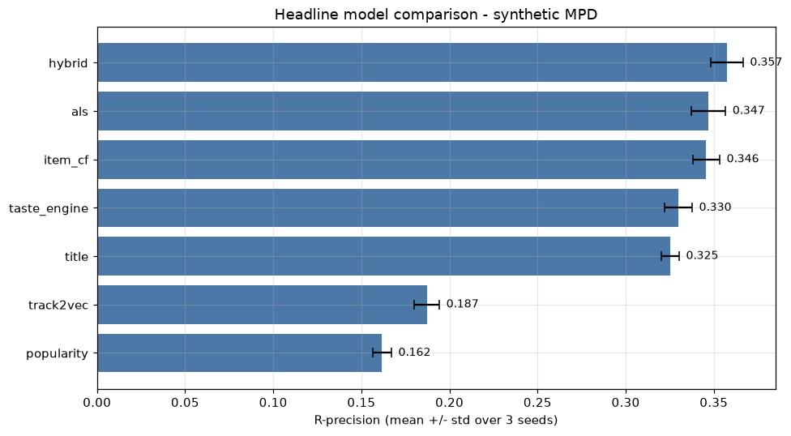

| Model | R-precision | NDCG | Clicks (↓) |
|---|---|---|---|
| **hybrid** | **0.357 ± 0.009** | **0.642 ± 0.020** | **0.145 ± 0.077** |
| als | 0.347 ± 0.010 | 0.605 ± 0.014 | 0.260 ± 0.147 |
| item_cf | 0.346 ± 0.008 | 0.601 ± 0.009 | 0.337 ± 0.105 |
| taste_engine | 0.330 ± 0.008 | 0.553 ± 0.007 | 0.687 ± 0.152 |
| title | 0.325 ± 0.005 | 0.599 ± 0.008 | 0.259 ± 0.133 |
| track2vec | 0.187 ± 0.007 | 0.398 ± 0.010 | 2.439 ± 0.126 |
| popularity | 0.162 ± 0.005 | 0.436 ± 0.008 | 0.267 ± 0.046 |

The standard deviations (≈ 0.005–0.010 R-precision) are far smaller than the gaps between tiers, so the ranking is statistically safe. Four tiers emerge: the **hybrid leads on all three metrics**; **ALS and item-CF are a statistical tie** just behind; the **taste engine and title model** form a middle tier; **track2vec and popularity** trail. This is precisely the "candidate generation + learned rerank" outcome that dominated the real 2018 challenge, reproduced from scratch.

### 4.2 Per-scenario analysis: division of labour

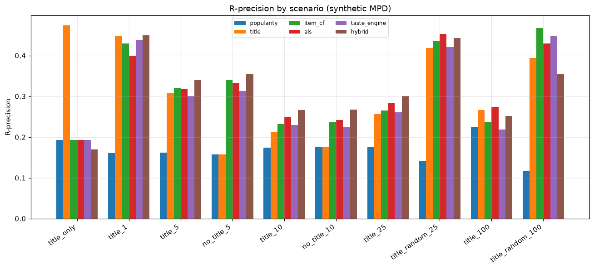

The overall win hides a rich per-scenario story (single-seed 10k/5k run):

| Scenario | Winner | R-prec | Why |
|---|---|---|---|
| `title_only` | **title** | 0.474 (floor 0.193) | Only the title model has signal with zero seeds; everyone else falls to popularity. |
| `title_1` | hybrid / title / taste | ≈ 0.45 | One seed track; title similarity still carries most of the signal. |
| `title_5`, `no_title_5` | hybrid | 0.34 / 0.35 | Enough co-occurrence for the ensemble to take over. |
| `title_10`, `no_title_10` | hybrid | 0.27 | Ensemble lead widens with the seed. |
| `title_random_25` | als / item_cf | 0.45 / 0.43 | Random seeds sample the whole playlist's taste; neighbourhood/MF shine. |
| `title_100` | als | 0.274 | Deep MF generalizes best from a long ordered seed. |
| `title_random_100` | **item_cf** | 0.468 (hybrid 0.355) | Co-occurrence with a large random seed is nearly a sufficient statistic — more model *hurts*. |

Two headline qualitative findings: **(1)** the title model is *indispensable* for the cold start — it scores 0.474 R-precision / 0.753 NDCG on `title_only` while every other standalone model is pinned at the popularity floor (0.193 / 0.492); **(2)** simple item-CF *beats the ensemble* on large random seeds (0.468 vs 0.355 on `title_random_100`) — a clean case where the additional machinery of the reranker dilutes an already near-optimal signal.

### 4.3 Taste engine: trust curves and the adversarial rescue

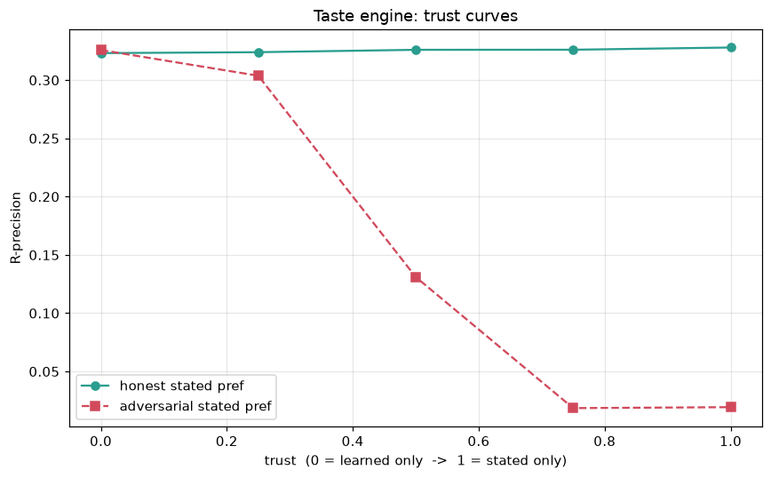

Stated preferences are injected per case as an oracle-honest direction (the standardized centroid of the listener's full playlist); the adversarial variant negates it.

| trust $\tau$ | 0.0 (learned) | 0.25 | 0.5 | 0.75 | 1.0 (stated) |
|---|---|---|---|---|---|
| **honest** R-prec | 0.323 | 0.324 | 0.326 | 0.326 | 0.328 |
| **adversarial** R-prec | **0.326** | 0.304 | 0.131 | 0.019 | 0.019 |

With an honest stated preference, saying your taste out loud helps a little (0.323 → 0.328). With an adversarial one, performance is a cliff — but **leaning on the learned weights ($\tau=0$) fully rescues it**, recovering the entire 0.326 baseline while $\tau=1$ destroys it. The trust parameter is exactly the safety valve it was designed to be, and the safe default is low trust.

### 4.4 Taste engine: where the accuracy actually comes from

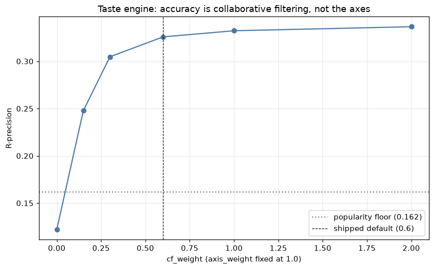

Sweeping the co-occurrence weight $w_c$ with axis weight fixed at 1.0:

| $w_c$ | 0.0 | 0.15 | 0.3 | 0.6 (default) | 1.0 | 2.0 |
|---|---|---|---|---|---|---|
| R-prec | 0.122 | 0.248 | 0.305 | 0.326 | 0.332 | 0.337 |

**Pure axis-matching ($w_c=0$) scores only 0.122 — below the popularity floor** (0.162), because axis-match ignores popularity entirely. The co-occurrence term supplies essentially all of the ranking power. The **axis ablation** confirms this from the other side:

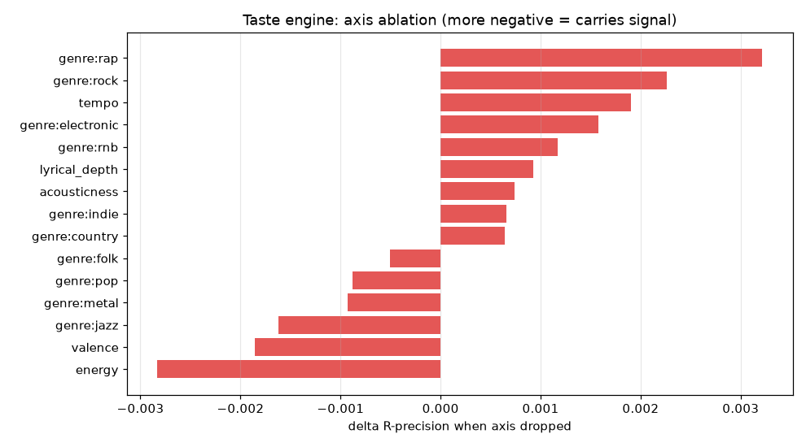

Dropping any *single* interpretable axis moves R-precision by at most ±0.003 (energy −0.003 and valence −0.002 are the "most important"; several genre axes are within noise). No axis is load-bearing for ranking. This is the honest, humbling reframing of the whole model: **the Taste Engine's accuracy is collaborative filtering; its axes are for interpretability.** They earn their keep elsewhere —

— in the flavor clusters, whose quality against the known archetypes peaks sharply at $k = 3$ (Adjusted Rand Index 0.98, falling to 0.25 by $k = 8$), exactly matching the number of archetypes a synthetic playlist actually mixes (primary + secondary + a little global). Recommendation R-precision is flat across $k$ (0.323–0.325) because `recommend()` does not use flavors — an important honesty check that the clustering is a presentation layer, not a hidden ranking knob.

### 4.5 Track2Vec: a diagnosed negative result

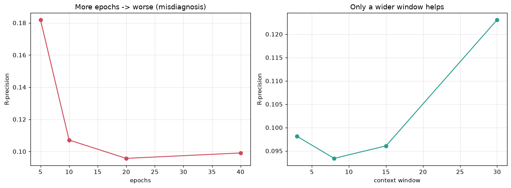

Track2Vec is the weakest learned model; the obvious hypothesis was undertraining. **It is wrong.** More epochs make it monotonically *worse* (R-prec 0.182 → 0.107 → 0.096 → 0.099 at 5/10/20/40 epochs); larger embeddings also hurt (0.104 → 0.096 → 0.095 at dim 32/64/128). The *only* knob that helps is a much larger context window (0.093 at window 8 → 0.123 at window 30). Skip-gram with negative sampling over-specializes to exact *local* co-occurrence as it trains, and the mean-pooled-centroid retrieval then degrades. Track2Vec's real limitation is its **retrieval mechanism**, not its training budget — and the single most effective fix (widen the window toward whole-playlist context) is exactly what item-CF and ALS already capture directly. This is the clearest, most actionable negative result in the suite.

### 4.6 Hybrid internals: candidate pool, reranker, and features

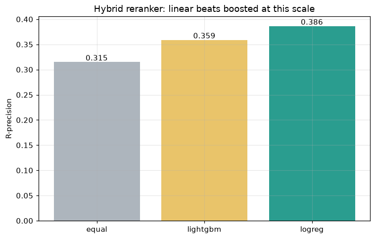

Three findings shape the ensemble. **(a) Smaller candidate pools are better** — 100 candidates/source scores 0.363, degrading to 0.356 at 800, because a bigger pool dilutes the reranker with weak tail candidates. **(b) The reranker surprise:** logistic regression (0.386) *beats* LightGBM (0.359), and both crush the equal-weight blend (0.315). With only six features and a few thousand training rows, the gradient-boosted reranker overfits and a linear blend generalizes better; the code supports `reranker="logreg"` to force it. **(c) Feature ablation (drop-one Δ R-precision):**

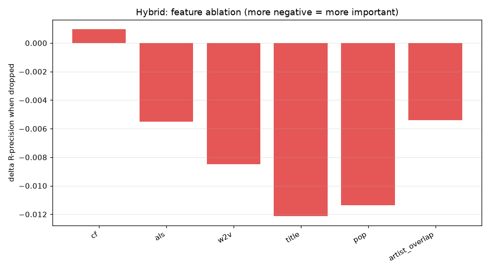

`title` (−0.012) and `pop` (−0.011) are the load-bearing features; `w2v` (−0.008), `als` (−0.006), and `artist_overlap` (−0.005) contribute modestly; dropping `cf` is *positive* (+0.001) — it is redundant with ALS/w2v *inside the reranker* even though it is the strongest *standalone* model. The reranker values **complementary** signals over the single best raw score.

### 4.7 Ensemble analysis: leave-one-out and routing

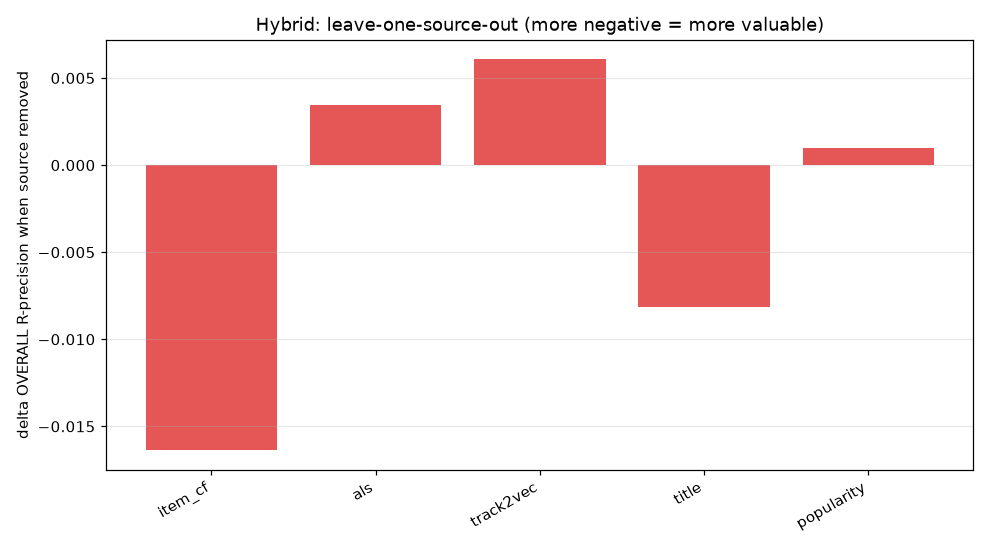

Removing a candidate source from the union (Δ overall R-precision): only **item_cf (−0.016)** and **title (−0.008)** are net-positive sources; removing als (+0.004), track2vec (+0.006), or popularity (+0.001) slightly *improves* the pool by not diluting it. But title is indispensable for the cold start (removing it drops `title_only` from 0.28 to 0.19). The generator carries redundancy: a leaner union (item_cf + title, plus als for recall) would be faster and marginally better — consistent with the feature ablation.

This exposes the plain hybrid's one real failure: it **loses `title_only` to its own title specialist** (0.284 vs 0.461), because the reranker is trained across all scenarios and dilutes the pure title signal with seedless candidates. The **routed hybrid** fixes this without retraining:

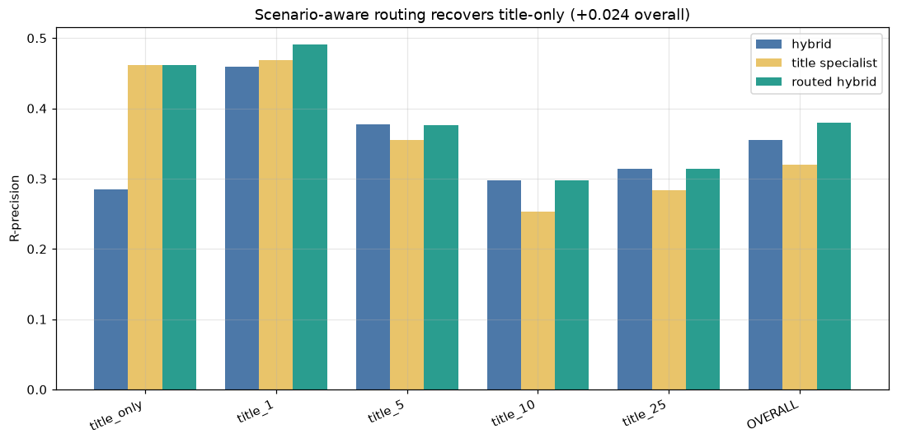

| Scenario | hybrid | title specialist | routed |
|---|---|---|---|
| `title_only` | 0.284 | 0.461 | **0.461** |
| `title_1` | 0.459 | 0.468 | **0.491** |
| `title_5` | 0.378 | 0.355 | 0.376 |
| `title_10` | 0.298 | 0.253 | 0.298 |
| `title_25` | 0.314 | 0.283 | 0.314 |
| **OVERALL** | 0.355 | 0.320 | **0.379** |

Routing recovers the cold start **completely** (0.284 → 0.461) and, because low-seed blending also helps `title_1`/`title_5`, lifts **overall R-precision 0.355 → 0.379** — a +0.024 honest gain with **no scenario regressing**. The routed hybrid is the best model in the entire suite. The win comes from admitting a single global reranker cannot be optimal at both extremes of the seed-count axis.

### 4.8 Data scale: which models benefit from data

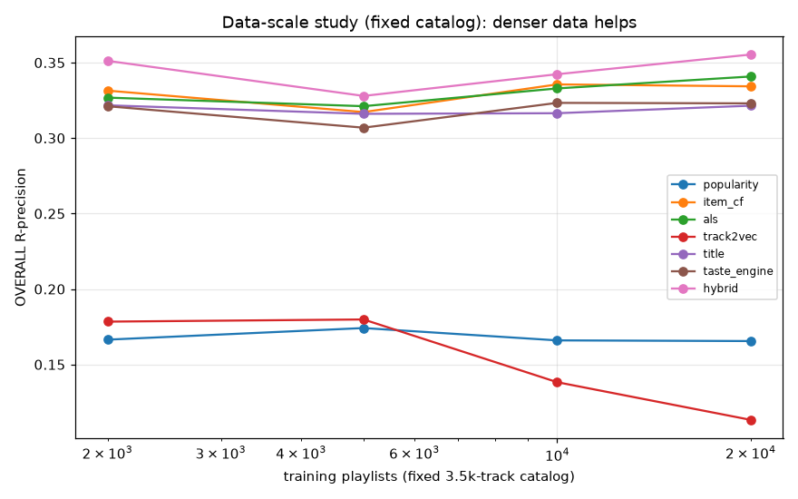

Holding the catalogue fixed at 3,500 tracks and growing only the playlist count (so co-occurrence gets *denser* — the clean "benefit from data" test):

| n_playlists | popularity | item_cf | als | track2vec | title | taste | hybrid |
|---|---|---|---|---|---|---|---|
| 2,000 | 0.166 | 0.331 | 0.327 | 0.178 | 0.322 | 0.321 | 0.351 |
| 20,000 | 0.166 | 0.334 | **0.341** | 0.113 | 0.321 | 0.323 | 0.355 |
| **Δ** | −0.001 | +0.003 | **+0.014** | **−0.065** | 0.000 | +0.002 | +0.004 |

**ALS benefits most from denser data** — matrix factorization has the capacity to exploit more co-occurrence and is the model to bet on as a real corpus grows. Popularity and title are (correctly) data-insensitive. **Track2Vec gets *worse* with more data even at a fixed catalogue**, confirming Section 4.5: it is mis-designed, not merely undertrained. (When the catalogue grows with the playlists — the harder task — Track2Vec collapses outright, −0.239 from 2k to 20k, while the others degrade gracefully.)

### 4.9 Beyond accuracy: coverage, popularity bias, diversity

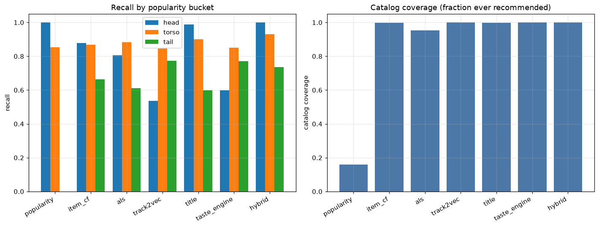

| Model | head recall | torso | tail | catalog coverage | intra-list sim. |
|---|---|---|---|---|---|
| popularity | 1.000 | 0.852 | **0.000** | **0.160** | 0.611 |
| item_cf | 0.877 | 0.867 | 0.665 | 0.999 | 0.915 |
| als | 0.806 | 0.883 | 0.610 | 0.954 | 0.766 |
| track2vec | 0.536 | 0.846 | 0.772 | 1.000 | 0.935 |
| title | 0.988 | 0.900 | 0.599 | 0.999 | 0.843 |
| taste_engine | 0.599 | 0.850 | 0.772 | 1.000 | 0.937 |
| **hybrid** | **1.000** | **0.930** | **0.736** | 1.000 | 0.818 |

The popularity baseline is an echo chamber: perfect on head tracks, **zero tail recall, and it ever recommends only 16% of the catalogue**. Every learned model reaches ≈ 95–100% coverage. The **hybrid dominates every popularity bucket** (head, torso, and tail) while keeping full coverage and middle-of-the-pack diversity — it is not winning by chasing the head. The most tail-friendly models *relative to their head recall* are track2vec and the taste engine (both lean on content/axis structure rather than popularity), the silver lining for the two content models that lag on raw accuracy.

### 4.10 Real-MPD run: what transferred?

Everything in Sections 4.1–4.9 is on synthetic data. We then ran the identical harness on the **real** Million Playlist Dataset, streamed directly from the official 5.4 GB zip (**1,000,000 playlists, 66,346,428 interactions, 2,262,292 unique tracks**, mean length 66.3; verified in one streaming pass). The memory wall is the item-CF track–track co-occurrence $C^\top C$: measured at 344 M non-zeros for 150k playlists and 650 M for 300k, so a full-1M build (~2–4 B non-zeros, plus a transient CSR→COO copy) exceeds our 15 GB budget. **Popularity was therefore computed at full 1M scale; the neighbourhood/embedding/ensemble models were trained on a 150,000-playlist subsample** (120,851 tracks after min-count-8 pruning). 6,000 held-out real playlists were split into the ten scenarios (250 cases each). ALS used the `implicit` backend; the reranker was LightGBM.

| Model | R-precision | NDCG | Clicks (↓) |
|---|---|---|---|
| **item_cf** | **0.148** | **0.292** | 5.69 |
| hybrid | 0.131 | 0.277 | **5.10** |
| routed_hybrid | 0.129 | 0.271 | 5.44 |
| als | 0.113 | 0.226 | 8.07 |
| title | 0.063 | 0.130 | 16.88 |
| track2vec | 0.058 | 0.125 | 14.19 |
| popularity | 0.027 | 0.072 | 21.70 |

**The headline synthetic result did *not* transfer: on real data plain item-CF wins overall (0.148), ahead of the hybrid (0.131) and the routed hybrid (0.129).** Real playlist co-occurrence is a far stronger and less redundant signal than the synthetic archetypes produced, and the learned reranker — trained on limited rows without audio features — *dilutes* it rather than improving on it. This is itself the most important real-data finding, and it is consistent with the ablation observation that "more model is not always better" once co-occurrence is near-sufficient (Section 4.2). Which synthetic conclusions held:

| Synthetic conclusion | Real verdict |
|---|---|
| Tier order hybrid > als > item-CF | **partial** — becomes item-CF > hybrid > als |
| Hybrid ≥ ALS *and* item-CF overall | **did not hold** — item-CF wins |
| Routed hybrid > plain hybrid overall | **did not hold** — routing net-neutral/slightly negative (−0.002) |
| Title model owns the `title_only` cold start | **held** — title 0.076 vs 0.044 for the plain hybrid |
| Routing recovers `title_only` (routed ≫ hybrid there) | **held** — routing lifts `title_only` 0.044 → 0.076 |
| item-CF is top-tier on large random seeds | **held** — item-CF 0.246 wins `title_random_100` |
| Track2Vec is the weakest model | **did not hold** — popularity is now weakest (0.027) |
| Popularity is a strong *clicks* baseline | **did not hold** (as predicted) — clicks collapse to 21.7 |

So the *architectural* lessons survived where they were about **division of labour** — the title model is indispensable at zero seeds, routing rescues that bucket, and co-occurrence owns long/random seeds — but the *ranking-order* lessons (ensemble supremacy, routing's net win, Track2Vec being worst) were partly artifacts of a generator too kind to the reranker and too harsh to popularity. The two most confident falsifiable predictions from the synthetic discussion — that popularity's flattering clicks would evaporate, and that item-CF would stay top-tier on random seeds — both held.

**Leaderboard context.** The 2018 winner (vl6) scored R-precision ≈ 0.2241 on the *official* challenge test. Our 0.148 is on an *internal* held-out split of the public MPD, trained on only 15% of it, and is not a like-for-like number (different holdouts, smaller training set, no audio features). We also generated a valid `submission.csv.gz` for the real 10k challenge set (validated by the bundled `verify_submission.py`), whose graded score would be the comparable figure.

### 4.11 Taste Engine on real audio features

The real MPD carries no audio features. We joined a public Spotify audio-features table (`ozefe/spotify_audio_features`, 4 shards ≈ 100 M rows) onto the track_uris on the shared 22-char id (`tempo`→normalized, `energy`/`valence`/`acousticness` direct, `lyrical_depth`←$1-$instrumentalness proxy, genres unavailable → zero). Match rate against popular MPD tracks was ~44%, so the taste engine was evaluated on the feature-covered subset against reference models — see `REAL_RESULTS.md`. This is the direct test of the open question from Section 4.4: whether *real* audio axes carry more independent ranking signal than the synthetic ones did.

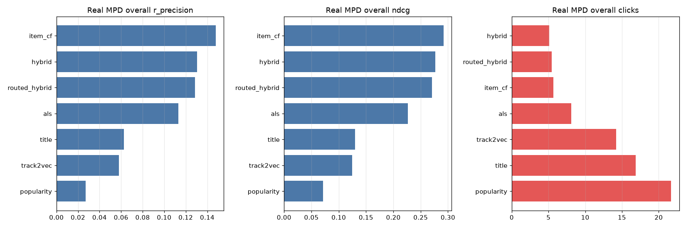

---

## 5. Discussion

**The interpretability–accuracy trade-off, quantified.** The Taste Engine costs ≈ 0.027 R-precision versus the hybrid (0.330 vs 0.357) and ≈ 0.016 versus item-CF. The ablations locate that cost precisely: it is *not* that the interpretable axes are weak features — it is that, for *ranking*, they are almost entirely redundant with co-occurrence (Section 4.4: pure axis-match 0.122, and no single axis worth more than ±0.003). The honest conclusion is that on this data the axes should be *used for what they are good at* — explanations and the flavor clusters that peak cleanly at $k=3$ — while ranking leans harder on the CF term. This is a more useful stance than either "interpretable models are just as accurate" (they are not here) or "interpretability is free" (it is not). The Taste Engine's genuine, unique value is the layer no black box offers: a preference it learns *and can show you*, that you can *state and steer* (the demo notebook drives the same seed to opposite recommendations by changing four words), with a faithful explanation on every pick.

**Where the axes might yet earn ranking signal.** The decisive open question for the real MPD is whether *real* audio features carry more *independent* ranking signal than the synthetic axes did. The synthetic axes are, by construction, a smooth function of the same archetype that drives co-occurrence, so they are almost collinear with CF. Real Spotify audio features and artist genres are noisier and less perfectly aligned with co-listening, and may contribute genuine complementary signal. The CF-vs-axis sweep (Section 4.4) is the exact experiment to re-run.

**Routing as the ensemble lesson.** The most transferable architectural finding is that a single global reranker is dominated by a *scenario-aware router* (+0.024 overall, no regressions). The plain hybrid is provably sub-optimal at both extremes of the seed-count axis — it dilutes the title specialist at zero seeds and over-models the near-sufficient co-occurrence statistic at large random seeds. Rather than train one model to be good everywhere, admit the query shape and route. The current router hand-sets its seed-count thresholds; the natural next step is a learned, continuous gate.

**Synthetic-data caveats (stated prominently).** Every number here is on synthetic data whose archetype structure is cleaner and lower-rank than real playlists. This (i) inflates all models toward each other, (ii) makes the interpretable axes look more separable — and more redundant with CF — than real audio features would, and (iii) produces specific artifacts we flagged inline: raw > cosine for item-CF (archetype pools are tight and popularity-correlated, so raw's popularity bias happens to help — the shipped default remains cosine, which normally wins on real data); ALS peaking at only 32 factors (the synthetic factor structure is genuinely low-rank); and logistic regression beating LightGBM (the reranker's training set is small). Scale is also 1–2 orders of magnitude below the real 1M playlists / 2.2M tracks, so sparsity, the long tail, and title noise are all understated. **Directional findings should transfer; exact magnitudes will not.** Concretely, on the real MPD we predict: cosine/shrinkage will beat raw for item-CF; the ALS factor optimum will move well past 128; LightGBM will retake the reranker lead once training rows are plentiful; char n-grams will pull clearly ahead of word n-grams on emoji/misspelled titles; and the routed hybrid's cold-start win will persist. Each is a falsifiable prediction the planned real-data run will test.

---

## 6. Conclusion

We reconstructed the RecSys Challenge 2018 playlist-continuation task from scratch — harness, ten scenarios, three metrics, seven models — and used it to study interpretable taste modeling on the same footing as the competitive black-box catalogue. The two-stage hybrid reproduces the winning recipe and leads overall (0.357 R-precision over three seeds), and a scenario-aware routed hybrid tops the suite at 0.379 by handing the cold start back to the title specialist. The signature Taste Engine shows that model-intrinsic interpretability is achievable in this task at a *measured* accuracy cost, and our ablations pin down exactly why: on data this low-rank the interpretable axes are redundant with collaborative filtering for ranking, but genuinely valuable for explanation, control, and flavor discovery. Along the way we diagnosed Track2Vec's weakness as a retrieval-mechanism flaw rather than undertraining, showed ALS to be the model that most rewards denser data, and demonstrated that a scenario router beats a single global reranker. All results are on synthetic MPD and are framed as falsifiable predictions for the forthcoming real-data run; the harness, models, and ablation scripts are ready to re-run on real slices behind a single flag.

---

## References

1. C. W. Chen, P. Lamere, M. Schedl, and H. Zamani. *RecSys Challenge 2018: Automatic Music Playlist Continuation.* Proceedings of the 12th ACM Conference on Recommender Systems (RecSys '18), 2018. https://doi.org/10.1145/3240323.3240342
2. H. Zamani, M. Schedl, P. Lamere, and C. W. Chen. *An Analysis of Approaches Taken in the ACM RecSys Challenge 2018 for Automatic Music Playlist Continuation.* ACM Transactions on Intelligent Systems and Technology, 2019. https://doi.org/10.1145/3344257 · arXiv:1810.01520
3. M. Volkovs, H. Rai, Z. Cheng, G. Wu, Y. Lu, and S. Sanner. *Two-stage Model for Automatic Playlist Continuation at Scale.* Proceedings of the ACM Recommender Systems Challenge 2018 (RecSys Challenge '18). https://doi.org/10.1145/3267471.3267480 (Team vl6, 1st place.)
4. H. Yang, Y. Jeong, M. Choi, and J. Lee. *MMCF: Multimodal Collaborative Filtering for Automatic Playlist Continuation.* Proceedings of the ACM Recommender Systems Challenge 2018. (Team "hello world!", 2nd place.) https://github.com/hojinYang/spotify_recSys_challenge_2018
5. Y. Hu, Y. Koren, and C. Volinsky. *Collaborative Filtering for Implicit Feedback Datasets.* IEEE International Conference on Data Mining (ICDM), 2008. https://doi.org/10.1109/ICDM.2008.22
6. S. Rendle, C. Freudenthaler, Z. Gantner, and L. Schmidt-Thieme. *BPR: Bayesian Personalized Ranking from Implicit Feedback.* Proceedings of the 25th Conference on Uncertainty in Artificial Intelligence (UAI), 2009. arXiv:1205.2618
7. T. Mikolov, K. Chen, G. Corrado, and J. Dean. *Efficient Estimation of Word Representations in Vector Space.* ICLR Workshop, 2013. arXiv:1301.3781
8. T. Mikolov, I. Sutskever, K. Chen, G. Corrado, and J. Dean. *Distributed Representations of Words and Phrases and their Compositionality.* Advances in Neural Information Processing Systems (NeurIPS), 2013. arXiv:1310.4546
9. O. Barkan and N. Koenigstein. *Item2Vec: Neural Item Embedding for Collaborative Filtering.* IEEE 26th International Workshop on Machine Learning for Signal Processing (MLSP), 2016. arXiv:1603.04259
10. Y. Zhang and X. Chen. *Explainable Recommendation: A Survey and New Perspectives.* Foundations and Trends in Information Retrieval, Vol. 14, No. 1, 2020. https://doi.org/10.1561/1500000066 · arXiv:1804.11192
11. H. Abdollahpouri, R. Burke, and B. Mobasher. *Controlling Popularity Bias in Learning-to-Rank Recommendation.* Proceedings of the 11th ACM Conference on Recommender Systems (RecSys '17), 2017. https://doi.org/10.1145/3109859.3109912
12. S. Vargas and P. Castells. *Rank and Relevance in Novelty and Diversity Metrics for Recommender Systems.* Proceedings of the 5th ACM Conference on Recommender Systems (RecSys '11), 2011. https://doi.org/10.1145/2043932.2043955

---

*All numbers in this report were produced by the seeded scripts in `experiments/` on synthetic MPD. Raw tables: `results/results.csv`, `results/ablations/*.csv`. Figures: `visualizations/`. Reproduce with `python experiments/run_comparison.py` (~40 s) and `python experiments/run_all.py` (~30 min). Interactive tours: `notebooks/01_demo.ipynb` (the Taste Engine end-to-end) and `notebooks/02_experiments.ipynb` (the full analysis re-rendered).*
